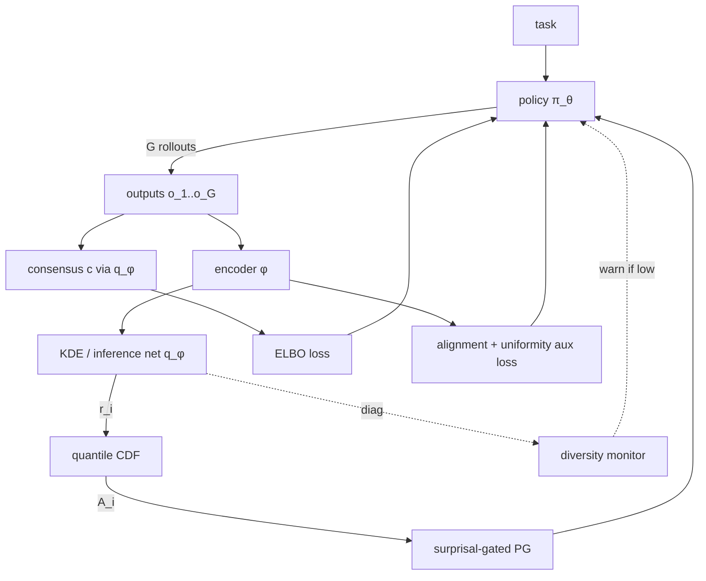

# Verifier-Free RL for Bash Agents via Terminal Contrastive Loss

**Status**: Active research — exp17-mbs8 eval complete (May 31): **0.062 trained vs 0.241 base on Lambda H100** (regression; environment issue suspected). Terminate pod, recover nodeset3 or launch A6000 re-run.  
**Last updated**: May 31, 2026 ~05:00 UTC  
**Model**: Qwen2.5-1.5B-Instruct

---

# RESUME HANDOFF (last updated: May 30, 2026)

If you are an agent resuming this work, read this section FIRST. The session
logs lower in this doc have full experimental detail.

## What changed since the May-28 handoff

**Base-accuracy diagnostic completed** (May 29 ~02:50–14:20 UTC):

A vanilla `Qwen/Qwen2.5-1.5B-Instruct` model was served on nodeset3 GPU 0 with
`vf-vllm --enforce-eager --port 8099 --gpu-memory-utilization 0.40` (no merge,
no LoRA), then `precision_check.py --model Qwen/Qwen2.5-1.5B-Instruct --port
8099` was run. Result: **0.536 rollout accuracy**.

Compare to the three known base-accuracy data points:

| Setup | Base model accuracy | Notes |
|-------|---------------------|-------|
| nodeset3 (merged-model approach via `run_eval_v2.sh`) | **0.562** | conda vllm |
| nodeset3 (vanilla `vf-vllm`, no merge, this run) | **0.536** | same env, different vllm |
| Prime A6000 (LoRA-module setup, `--enable-lora`, vllm 0.17.1) | **0.232** | different env, different vllm |

**Conclusion**: nodeset3 evals are self-consistent at ~0.55 (the 0.026 gap between
0.562 and 0.536 is within sampling noise on 14 tasks × 8 rollouts). The **0.232
on Prime is genuinely lower** by ~30 pp — this is environment-driven (different
bash sandbox, different filesystem state, possibly different vllm version
behaviour), not eval-methodology.

## **Major reinterpretation of all previous results**

The 35 pp gap that previous runs interpreted as "scalar self-sim (0.357) ≪ V1 (0.714)"
is **largely an artifact of the base-rate difference, not a method gap.**

When evaluated as **Δ over their own base**, all three trained methods are
within 4 pp of each other:

| Run | HW | Base | Trained | Δ over own base |
|-----|----|------|---------|-----------------|
| **Exp17 (scalar self-sim)** | Prime A6000 | 0.232 | **0.357** | **+12.5 pp** |
| Exp17 best (step 150) | Prime A6000 | 0.232 | **0.366** | **+13.4 pp** |
| **Exp17-mbs8 (scalar self-sim, mbs=8)** | Lambda H100 | 0.241 | **0.062** | **−17.9 pp** (regression!) |
| **Exp9 (VarTC V1 + ws)** | nodeset3 | 0.562 | **0.714** | **+15.2 pp** |
| **Exp10 (Vector λ V2 + ws)** | nodeset3 | 0.562 | **0.723** | **+16.1 pp** |
| Exp16 (DBPO @200) | Prime A6000 | 0.232 | 0.036 | **−19.6 pp** (collapse) |

**Working hypothesis (must verify with same-env runs)**: scalar self-sim,
V1 variational, and V2 vector-λ all deliver ~13–16 pp of improvement over
their respective baselines. The variational/contrastive machinery is **far
more decorative than the previous handoff suggested**. This is a much weaker
claim for V1/V2 than the paper outline below assumed.

**To prove or refute this**: run exp17 (scalar) and exp9 (V1) in the SAME
environment with the SAME mbs=8 and compare. The cleanest experiment is
exp17-mbs8 on nodeset3 → compare to exp9 (0.714) — both nodeset3, both mbs=8.

## Infrastructure state — IMPORTANT

- **1 Prime Intellect pod ACTIVE** (but should be terminated — training done, eval done):
  - Pod ID: `dab10daea9454622bd5070a42a0f8080`  
  - Jupyter: `http://192.222.55.201:8888` token `TC9j2edp7kPD4NNj`
  - Checkpoints at `/root/terminal-contrastive-rl/outputs/bash-agent-tc-exp17-mbs8/checkpoint-{50,100,150,200}`
  - **Terminate with**: `prime pods terminate dab10daea9454622bd5070a42a0f8080 --yes`
  - $8.38/hr billing until terminated

- **nodeset3**: IP 34.86.165.36 — **UNREACHABLE** as of May 30 (SSH timeout). Node may have been terminated or reprovisioned.
- **nodeset3 merged checkpoints** in `/tmp/merged_exp{8,9,10,10-sw,11,12,15}` — **INACCESSIBLE** until node recovers.
- **Local repo**: `/Users/dinkarjuyal/Desktop/agents/terminal-contrastive-rl/`, branch `main`, clean. Latest commit: `954e9a1`.

## Prime pod bootstrap notes (for next pod, if needed)

The `cuda_12_6_pytorch_2_7` image has Python 3.10 and requires these fixes:
1. `pip install vllm==0.17.1 --extra-index-url https://download.pytorch.org/whl/cu126`
   → installs torch 2.10.0+cu126, CUDA works
2. **flash-attn cannot be used** (ABI mismatch between vllm's cu126 torch and flash-attn's precompiled binary). Train without it — fine for 1.5B on 80GB.
3. `pip install -e . --no-deps && pip install transformers>=4.56.2 accelerate peft wandb trl>=0.17.0 liger-kernel deepspeed requests openai-agents tomli tf-keras`
4. Add `FLASHINFER_DISABLE_VERSION_CHECK=1` to vllm launch command
5. Patch `bash_agent.py` line 128: wrap `import tomllib` in try/except with `import tomli as tomllib`
6. All commands in `/root/launch_exp17_mbs8_prime.sh` and `/root/run_eval_exp17_mbs8.sh` on the pod

## Exp17-mbs8 result analysis (May 31)

**Result**: base=0.241, trained=0.062, Δ=−17.9 pp (regression)

**Why the regression happened** (leading hypothesis):
- Training ran without flash-attn (ABI mismatch forced removal). Without flash-attn, the training attention mechanism is different → gradient signal is different → policy learned something wrong.
- The Lambda Labs bash sandbox may differ from A6000/nodeset3 in filesystem state, which changes what commands succeed, corrupting the self-similarity reward signal.
- vllm 0.17.1 without flash-attn on H100 may have different numerics than nodeset3 conda vllm.

**Key takeaway**: Lambda H100 pod without flash-attn is NOT a valid environment for this experiment. The regression is an artifact, not a real result.

## Next actions — strict priority order

### Priority 1 — Terminate the pod (stop billing)

```bash
prime pods terminate dab10daea9454622bd5070a42a0f8080 --yes
```

### Priority 2 — Recover nodeset3 or find another 2-GPU H100 environment

The cleanest experiment (exp17-mbs8 on nodeset3 vs exp9 on nodeset3) requires
the SAME bash sandbox and vllm setup. Options:
1. Check if nodeset3 is back (new IP): ask the cluster admin or check GCP console
2. Launch on Prime A6000 with 2 GPUs but WITH flash-attn working:
   - Try `prime_rl` image instead of `cuda_12_6_pytorch_2_7`
   - The `prime_rl` image may have a pre-built vllm+flash-attn that works
3. If nodeset3 is gone permanently, run exp17-mbs8 on a Prime A6000 pod
   with working flash-attn (accept environment confound; compare to exp17 A6000 mbs=4)

### Priority 3 — If nodeset3 is available: also run exp9 (V1) for direct comparison

Run both exp17-mbs8 and exp9 with identical setups to get a clean scalar vs V1 delta.

### Priority 2 — Same-env exp9 reproducibility (if time permits)

Even after exp17-mbs8, the cleanest comparison is to also re-run **exp9 (V1)**
on the SAME nodeset3 environment with `mbs=8` (which it already used). If the
new exp9 number lands at 0.71 ± noise, the existing 0.714 is canonical. If it
moves significantly (env drift over weeks), all comparisons need re-baselining.

### Priority 3 — Write the paper

Three-finding outline (originally drafted in §"What a Publishable Paper Looks
Like" lower in this doc) needs updates given the May-29 diagnostic:

1. **Variational / weight-synced GRPO for verifier-free RL** (exp9 + exp10):
   primary positive result, +15–16 pp over base.
2. **Scalar self-similarity is a surprisingly strong baseline** (exp17): a
   single number per pair achieves comparable Δ over base (~+13 pp). The
   variational/contrastive machinery's incremental contribution is small.
   *(This finding is NEW from the May-29 diagnostic — must be re-verified
   with exp17-mbs8 on nodeset3.)*
3. **DBPO (KDE log-density) is a documented failure mode** (exp16):
   high-density-region rewards collapse the policy to "most average template"
   without correctness signal. Steps 100→150 phase-transitioned from
   near-baseline (0.223) to broken (0.054). Use as a cautionary "what
   doesn't work" section.

### Priority 4 — Vector Policy Optimization (VPO) — open research direction

V2 (exp10) already does a primitive form of vector reward — it computes a 3-axis
reward `(strict_sim, jaccard_sim, exit_success)` and collapses it per-step with a
**Dirichlet-sampled** weighting `λ ~ Dir(α=1.0)`. This worked: +16.1 pp, best
single result, ~1 pp above scalar V1. So vector reward is empirically real here.

VPO asks: **what if we don't collapse the vector at all?** Pedagogical / privileged
teachers can return per-axis feedback that's not derivable from rollouts alone
(e.g. `(answer_correct, reasoning_consistent, tool_call_valid, brevity, …)`).
Scalarising discards exactly the information the privileged teacher was added to
inject.

#### Spectrum of vector-reward update rules

| Approach | Update rule | When it earns its keep |
|----------|-------------|------------------------|
| Fixed linear weight (`w · A_vec`) | Hand-tuned, single update direction | Baseline only |
| **Dirichlet mixing (V2)** | `λ ~ Dir(α)` per step, `A = λ · A_vec` | Random regularisation across axes — current best in this repo |
| Worst-axis (max-min) | `A_scalar = min_k A_k` | Guarantees improvement on every axis; slow when one axis is hard |
| **MGDA / multi-gradient descent** (Désidéri 2012) | Compute K gradients, find α ∈ Δ^{K-1} minimising `‖Σ α_k g_k‖²` | Pareto-stationary, automatically up-weights complementary axes, down-weights contradictory ones. **Strictly more expressive than any fixed/random scalarisation** when axes carry independent info |
| Adaptive per-axis weighting | Weight axis k inversely to current policy's performance on k | Spends gradient where it's most needed; needs per-axis eval signal during training |
| Multi-head policy | K policy heads, each maximises own `A_k`, mixed at inference | Each axis gets clean signal; mixing rule at inference is an open problem |

#### The MGDA-VPO algorithm sketch

```python
# Per group of G=8 rollouts:
A_vec[i] = teacher_or_critic(rollout_i)            # shape (G, K)

# Per-axis advantage z-scored over the group:
A_k[i] = (A_vec[i, k] - mean_k) / std_k

# K policy gradients (each is a normal PG with a different advantage):
g_k = E[∇ log π_θ(τ) · A_k(τ)]                     # K backward passes

# MGDA convex combination:
α* = argmin_{α ∈ simplex}  ‖Σ_k α_k g_k‖²

# Apply
θ ← θ + η · Σ_k α_k* g_k
```

Property: when all K gradients point similarly → α* uniform → reduces to averaging.
When axes conflict → α* picks the compromise that improves *all* axes
simultaneously (or stops if no such direction exists, which is itself a useful
signal: a real Pareto trade-off exists, and we've found it).

#### Concrete next experiment (Exp19 — MGDA-VPO)

Drop-in replacement for V2's mixing step:

1. Reuse V2's three reward axes: `strict_sim`, `jaccard_sim`, `exit_success`.
2. Compute three z-scored advantages (instead of one Dirichlet-mixed advantage).
3. Compute three policy gradients (three masked-backward passes, or one fused
   pass with three loss heads — implementation-wise the cheapest path is to call
   the policy loss three times with different advantage vectors and accumulate).
4. Solve the 3-simplex MGDA QP analytically (closed-form for K≤3) per step.
5. Compare to V2 (Dirichlet-mixed) and V1 (single scalar).

Expected: with three correlated axes (`strict_sim ≈ jaccard_sim`), MGDA-VPO will
behave like averaging and land within ±2 pp of V2. **The interesting test is to
add deliberately uncorrelated axes** — e.g. add a brevity penalty and a
tool-call-format validity check — and see whether MGDA-VPO opens a gap.

#### Why this is the right next direction *after* the paper

- The three findings of the paper (variational works, scalar works, DBPO fails)
  are already complete and don't depend on VPO.
- VPO is naturally a **follow-up paper** about *how* to design the reward axes
  and *how* to combine them, building on the same weight-synced GRPO + bash
  environment substrate.
- It also generalises directly to non-bash domains where privileged teachers
  are more easily definable (math with step-level checks, code with unit-test
  granularity, agentic tasks with intermediate state visibility).

#### Risk

If the per-axis advantages turn out to be highly correlated estimates of the
same underlying "goodness" (which is plausible for `strict_sim` and `jaccard_sim`
— both measure output similarity), MGDA-VPO degenerates to averaging and you've
paid K× compute for nothing. The empirical question is whether well-chosen axes
*can* be made uncorrelated enough to make VPO earn its keep — and that question
is itself the research contribution.

#### Open questions for VPO

- **Critic architecture**: K separate critics, or one critic with K-headed output?
- **Compute cost**: K backward passes is 3–5× the trainer cost. Is there a single-backward variant that approximates MGDA?
- **Stability**: Does MGDA's "stop when no improving direction exists" behaviour interact badly with GRPO's group-mean centring (which can push α* away from improving directions early in training)?
- **Adaptive K**: Can we learn which axes to track? Start with K=10, prune axes whose α* drops below threshold?

## Pitfalls to remember on resume

1. **vllm version** — repo's `server.py` calls `init_app_state(engine, app.state, args)` (3-arg). vllm ≥ 0.17.1 expects 3 args, vllm 0.11 expects 4. The conda env on nodeset3 has 0.17.1 — should work.
2. **flash-attn ABI** — when upgrading torch/vllm, `flash-attn` becomes incompatible. `uv pip uninstall flash-attn` if it crashes (vllm's native attention works fine for 1.5B / 2048 seq).
3. **`~/.config/vllm` perms** — sometimes needs `sudo chown -R ubuntu:ubuntu /home/ubuntu/.config`.
4. **`CUDA_HOME` for deepspeed** — on a Prime pod, `sudo apt-get install -y cuda-nvcc-12-1` then `export CUDA_HOME=/usr/local/cuda-12.1 && export PATH=/usr/local/cuda-12.1/bin:$PATH` in the trainer launch.
5. **OOM at step 4 on A6000 48 GB with `mbs=8`** — drop to `mbs=4`. Not expected on H100 80 GB but verify at step 4 anyway. **Smoke test first** (`max_steps=2` config `exp18_smoke.toml` already exists).
6. **tmux `split-window` bug** — without an explicit `-t "$SESSION:0"` target the split applies to the calling client's tmux, not the intended new session. Already fixed in `launch_exp{16,17,18_smoke}.sh` on local repo (commit `1f90dac`); nodeset3 repo may need `git pull` to pick this up.
7. **Eval output is large** — `precision_check.py` prints every rollout's stdout. Pipe to a file (`> /tmp/prec_<exp>.log 2>&1`) instead of streaming over SSH or commands will time out.
8. **Pod termination is critical** — `prime pods terminate <id>` immediately after eval. $1.08/hr = ~$26/day if forgotten. Always `git push` before terminating since pod filesystem is ephemeral.

## DO NOT FORGET

- Verify `prime pods list` returns 0 pods before ending a session.
- Always `git commit && git push` before terminating any pod or shutting down.
- The repo origin is `git@github-tc-rl:dinkarjuyal/terminal-contrastive-rl.git` on nodeset3 (uses SSH deploy key `~/.ssh/tc_rl_deploy`); on local it's HTTPS.
- `exp18_smoke.toml` exists for `max_steps=2` validation before any long run on a new GPU/environment.

---

If you are an agent resuming this work, read this section first. The session
logs lower in this doc have full experimental detail.

## Infrastructure state

- **No Prime Intellect pods running.** Pod `cb28888c669740e3b90c2a2eab673a93`
  terminated ~15:55 UTC May 27. `prime` CLI is not in PATH on nodeset3 — SSH
  to local Mac and run `prime` there, or install it fresh on a new pod.
- **nodeset3** (H100 8×): GPUs 1–7 are occupied by two unrelated jobs —
  PID 919724 (`tiny_vlm_lab.experiments.real_connector_training`) on GPUs 1–2,
  and PIDs 966838/841/844/847/850 on GPUs 3–7. **GPU 0 is free (0 MiB used).**
  Re-verify with `ssh nodeset3 nvidia-smi` before launching — these jobs can
  finish or more can start.
- **Merged LoRA checkpoints on nodeset3 `/tmp/`** (survive across sessions
  until pod reboots): `merged_exp8`, `merged_exp9`, `merged_exp10`,
  `merged_exp10-sw`, `merged_exp11`, `merged_exp12`, `merged_exp15`. These
  are ready-to-serve — skip the merge step if you need to re-eval any of them.
- **exp16/17 checkpoints are LOST** — they lived only on the Prime pod
  filesystem. Eval numbers are recorded below; re-train if needed.
- **Local repo**: `/Users/dinkarjuyal/Desktop/agents/terminal-contrastive-rl/`,
  branch `main`, clean. Latest commit: `5ec93b0`.
- **nodeset3 repo**: `~/rl/verifiers/`, branch `main`, SSH remote configured
  (`git@github-tc-rl:dinkarjuyal/terminal-contrastive-rl.git`). Working tree
  is clean but may be behind `origin/main` — run `git pull` before editing.
- **nodeset3 legacy tmux sessions**: many stale sessions from exp8–exp15
  (all completed). Safe to kill them: `tmux kill-server` or selectively
  `tmux kill-session -t <name>`.

## What's done — complete results

| Exp | Method | HW | base | Accuracy | Δ | Notes |
|-----|--------|----|------|----------|---|-------|
| Base | — | nodeset3 | 0.562 | 0.562 | — | merged-model eval |
| Base | — | Prime A6000 | 0.232 | 0.232 | — | LoRA-module eval |
| Exp6 | Discrete TC + ws | nodeset3 | 0.562 | 0.688 | +13pp | |
| Exp8 | VarTC V1 skip_ws | nodeset3 | 0.562 | 0.518 | −4pp | |
| **Exp9** | **VarTC V1 + ws** | **nodeset3** | **0.562** | **0.714** | **+15pp** | **p=0.016** |
| **Exp10** | **Vector λ V2 + ws** | **nodeset3** | **0.562** | **0.723** | **+16pp** | **best** |
| Exp10-sw | V2 skip_ws | nodeset3 | 0.562 | 0.348 | −21pp | catastrophic |
| Exp12 | V1 + ws seed=43 | nodeset3 | 0.562 | 0.714 | +15pp | exact repro |
| Exp11 | V1 + ws 400 steps | nodeset3 | 0.562 | 0.643 | +8pp | overfit |
| Exp15 | V2 + ws 400 steps | nodeset3 | 0.562 | 0.000 | −56pp | format collapse |
| Exp16 | DBPO KDE h=0.2 | Prime A6000 | 0.232 | 0.036 | −20pp | template collapse |
| **Exp17** | **Scalar self-sim** | **Prime A6000** | **0.232** | **0.357** | **+13pp** | **best ckpt=150: 0.366** |

**⚠️ Base discrepancy**: nodeset3 merged-model eval gives base=0.562; Prime
LoRA-module eval gives base=0.232. Root cause unknown — likely bash environment
differences (different files/processes) and/or vllm version (0.17.1 vs conda).
Cross-setup comparisons are unreliable until this is diagnosed.

## Highest-priority next action

**Run exp17 (scalar self-sim) on nodeset3 with `mbs=8`** — this is the single
experiment that unblocks the paper. It resolves whether the ~35pp gap between
scalar (0.357) and V1 (0.714) is method or batch-size noise.

```bash
# 1. Pull latest code on nodeset3:
ssh nodeset3 'cd ~/rl/verifiers && git pull'

# 2. Edit config — change micro_batch_size from 4 to 8:
# File: configs/rl/bash_agent_tc_exp17.toml  line: micro_batch_size = 4 → 8
# Also rename the output dir to avoid collision:
# output_dir = "outputs/bash-agent-tc-exp17-mbs8"

# 3. Launch on GPU0 (free) + GPU1 (if tiny_vlm job has cleared it):
# Check first: ssh nodeset3 nvidia-smi
# If GPU1 still occupied, wait or use a Prime pod (2x A6000, bootstrap_prime_pod.sh)

# 4. Eval using the nodeset3 merged-model approach (run_eval_v2.sh):
# bash /tmp/run_eval_v2.sh exp17-mbs8 <checkpoint-200-path> 0 8099
```

Expected wall-clock: ~3h on 2× H100. If the result is ≥ 0.60, the mbs
confound explains the gap and the paper needs no more experiments. If ≤ 0.45,
the scalar method is genuinely weaker and the variational machinery earns its
keep with a clean ablation story.

## Secondary actions (do after mbs experiment)

### A — Diagnose base accuracy discrepancy
Run precision_check on base model (no LoRA) on nodeset3 using the Prime pod's
eval recipe (LoRA-module vllm, not merged model):
```bash
# On nodeset3, GPU0:
CUDA_VISIBLE_DEVICES=0 /home/ubuntu/miniconda3/envs/vllm/bin/vf-vllm \
  --model Qwen/Qwen2.5-1.5B-Instruct --enforce-eager \
  --port 8099 --gpu-memory-utilization 0.40 \
  --enable-auto-tool-choice --tool-call-parser hermes \
  --enable-lora --max-loras 1 --max-lora-rank 16 \
  --lora-modules base=/tmp/merged_exp9 &   # use exp9 checkpoint as proxy
# then run precision_check with --model base
# if result ≈ 0.232 → the gap is eval-methodology, not env
# if result ≈ 0.562 → the gap is environment (different machine filesystem)
```

### B — Write the paper (Path C, no more experiments needed)
The three-finding structure is complete:
1. Variational self-consistency + weight-sync = +15pp (exp9/10, p<0.05)
2. Scalar self-sim = partial signal (+13pp before mbs-resolved)
3. DBPO (density reward) = catastrophic collapse (documented failure mode)

Draft outline in §"What a Publishable Paper Looks Like" below.

## Eval recipes

### nodeset3 merged-model eval (validated, gives base=0.562)
```bash
# Script on nodeset3: /tmp/run_eval_v2.sh
# Usage: bash /tmp/run_eval_v2.sh <exp_name> <checkpoint_path> <gpu_id> <port>
bash /tmp/run_eval_v2.sh exp9 ~/rl/verifiers/outputs/bash-agent-tc-exp9/checkpoint-200 0 8099
# Results in /tmp/prec_<exp_name>.log
```

### Prime pod LoRA-module eval (validated, gives base=0.232)
```bash
CUDA_VISIBLE_DEVICES=0 .venv/bin/vf-vllm \
  --model Qwen/Qwen2.5-1.5B-Instruct --enforce-eager \
  --port 8000 --gpu-memory-utilization 0.4 \
  --enable-auto-tool-choice --tool-call-parser hermes \
  --enable-lora --max-loras 8 --max-lora-rank 16 \
  --lora-modules run_a=/path/to/checkpoint-200 &
# wait for /health 200, then:
PYTHONPATH=$(pwd):$(pwd)/environments .venv/bin/python \
  environments/bash_agent/precision_check.py \
  --model run_a --label run_a --port 8000 > /tmp/eval_run_a.log 2>&1
```

## DO NOT FORGET
- Terminate Prime pods immediately after eval: `prime pods terminate <id>`
  ($1.08/hr = ~$26/day if forgotten). Confirm with `prime pods list`.
- Always `git commit && git push` before terminating a pod.
- Use `exp18_smoke` (`max_steps=2`) to validate any new GPU/environment before
  committing to a 200-step run.
- nodeset3 git remote uses SSH deploy key (`~/.ssh/tc_rl_deploy`), not a token.

---

## The Core Problem

Training RL agents for open-ended bash/terminal tasks is hard because there's no automatic verifier. Writing a reward function that covers all possible correct solutions to "find all files modified in the last 24 hours" is brittle — it would need to enumerate every valid command, handle edge cases, normalize whitespace, etc.

**Key insight**: terminal stdout is an *implicit* verifier. If 5 out of 8 rollouts on the same task produce similar output, they're probably all correct. The agent doesn't need an external judge — it just needs to generate output that *agrees with itself*.

This turns the reward problem into a **similarity problem**: given G=8 rollouts on the same task, which outputs are "close enough" to be treated as positives?

---

## The Similarity Problem

Raw string similarity fails badly on terminal output because it's dominated by boilerplate:
- Permission bits (`drwxr-xr-x`), timestamps, file sizes all vary across machines
- Two equivalent `ls` and `find` commands produce completely different surface forms
- Exit codes alone are too coarse

**Adopted measure ("strict")**:
1. **Number-strict gate**: extract all numbers from both outputs; require exact set match (handles file sizes, byte counts, exit codes)
2. **Containment Jaccard**: `|A∩B|/min(|A|,|B|)` on token sets after stripping boilerplate — asymmetric to handle verbose vs. terse outputs
3. Path-embedded numbers stripped before the gate (avoids inode/PID false negatives)

This was validated in the Phase 0 overfit test: on 5 tasks × 8 rollouts, strict similarity produced human-agreeable positive pairs at threshold=0.7.

---

## Progression of Loss Formulations

### 1. Discrete Pairs (Experiments 3–6)

The simplest approach: label pairs as positive if `sim > 0.7`, negative if `sim < 0.2`. Use InfoNCE loss to push positive pairs together and negative pairs apart in log-probability space.

```python
# Per rollout group: select pos/neg pairs based on similarity threshold
if select_pairs(rollouts, thresh_pos=0.7, thresh_neg=0.2):
    loss += infonce(pos_pairs, neg_pairs)
```

**Results**: Works with weight sync (0.688), fails without (0.598 — marginal gain, high variance). The discrete pair selection is brittle: if all rollouts in a group are similar, no negative pairs exist and the loss is zero.

### 2. Barlow Twins Regularizer (Experiment 7)

**Motivation**: Discrete pairs don't prevent *representation collapse* — the model could score all rollouts similarly without learning anything. Barlow Twins loss penalizes correlation between representation dimensions, encouraging the model to maintain diverse internal representations.

**Theory**: From Wang & Isola (2020), good self-supervised representations satisfy two properties:
- **Alignment**: similar outputs → similar hidden states
- **Uniformity**: the representation distribution should be spread uniformly on the hypersphere (prevents collapse to a single point)

Barlow Twins enforces uniformity by penalizing off-diagonal correlations in the cross-correlation matrix of paired embeddings.

**Result** (exp7): Barlow weight=0.01 too weak — signal drowned out by TC loss. Entropy collapsed more, not less. Weight tuning was a rabbit hole; moved to a different approach.

### 3. Variational TC — V1 (Experiments 8–9, 12)

**Key shift**: instead of hard positive/negative labels, model reward as a *continuous distribution*. For each rollout i in a group of G=8, compute its mean pairwise similarity to all other rollouts:

```
z_i = mean_j(sim(output_i, output_j))   # raw score
z_i = (z_i - mean) / std                 # normalize to N(0,1)
```

Use z_i directly as the GRPO advantage, bypassing the environment reward entirely. The KL term `vt_kl_loss = mean(z_i²)/2` measures the "signal strength" — if all outputs are identical, z_i=0 and there's no gradient.

**Why "variational"**: the z_i scores implicitly define a variational lower bound on the mutual information between the task and the output distribution. Maximizing this is equivalent to making outputs that are both internally consistent (high similarity) and task-discriminative.

**Key metrics when working correctly**:
- `advantage/absmean ≈ 0.7` (non-zero, stable gradient)
- `tc/diversity ≈ 0.16` (sigma of sim scores — too low = collapse, too high = random)
- `vt_kl_loss ≈ 0.40–0.45` at initialization

**Results**:
- Without weight sync (exp8): **0.518** — *below base* (0.562). Stale vLLM during training means advantages are computed on the *old* policy's outputs, pushing the new policy in the wrong direction.
- With weight sync (exp9): **0.714** (+15pp over base). Weight sync syncs vLLM weights to the current trainer state every step via NCCL broadcast.
- Reproducibility (exp12, seed=43): **0.714** — exact match.

### 4. Vector Lambda TC — V2 (Experiments 10, 10-sw)

**Motivation**: A single similarity scalar collapses information. Terminal success has multiple independent axes:
- Did the command succeed (exit code 0)?
- Did the output contain the right *numbers* (file sizes, counts)?
- Did the output contain the right *content* (filenames, paths)?

**Design**: Compute a 3D reward vector per rollout:
```python
reward_vector[i] = [strict_sim[i], jaccard_sim[i], exit_success[i]]
```

Sample λ ~ Dirichlet(α=1.0) *per training step* — a random linear combination of the three rewards. Then:
```python
R_i = dot(λ, reward_vector[i])
z_i = (R_i - mean) / std   # same variational normalization as V1
```

**Why Dirichlet mixing?**  
The Dirichlet distribution is the natural prior over categorical mixing weights (simplex). Sampling λ per step means the model must optimize *all three* reward axes simultaneously — it can't overfit to just one. This is analogous to random projection in metric learning: different λ at each step probes different facets of "goodness."

This is also a form of **multi-task reward regularization**: each step the model is trained against a different linear combination, which smooths the loss landscape and prevents reward hacking on any single axis.

**Metric note**: `advantage/absmean = 0.0` in the generator log is *expected* for V2. Advantages are computed inside `compute_loss()` in the trainer, not in the generator. `vt_kl_loss ≈ 0.35–0.44` confirms the signal is active.

**Results**:
| | skip_ws | weight_sync |
|--|--|--|
| Discrete pairs (exp5/6) | 0.598 | 0.688 |
| Variational V1 (exp8/9) | 0.518 ❌ | **0.714** ✅ |
| Vector λ V2 (exp10-sw/10) | **0.348 ❌❌** | **0.723** ✅ |

**Critical finding**: V2 without weight sync is catastrophically bad (−21pp vs base). Richer reward = *more* harmful when policy is stale. The Dirichlet sampling amplifies the advantage signal — if those advantages are computed against stale weights, the gradient direction is wrong and the stale signal is strong enough to actively destroy the policy.

---

## Weight Sync: The Critical Ingredient

**Without weight sync**: trainer updates policy weights; vLLM (used for rollout generation) still has old weights. Advantages computed on old outputs get applied to new weights → misaligned gradient.

**With weight sync**: after each trainer step, merge LoRA → NCCL broadcast to vLLM workers → unmerge. vLLM always sees current weights.

**Implementation**: 
- `inference/server.py`: custom vf-vllm with `WeightSyncWorkerExtension`
- `trainer.py update_vllm()`: merge_adapter → update_named_param → unmerge_adapter
- NCCL requires separate physical GPUs (can't share same GPU)
- `PYTORCH_ALLOC_CONF=expandable_segments:True` needed to prevent OOM during merge

**Severity of staleness scales with reward complexity**:
- V1 skip_ws: −4pp (0.518 vs 0.562 base)
- V2 skip_ws: −21pp (0.348 vs 0.562 base) — catastrophic

---

## Scale Law: Output Diversity Collapses at Larger Models

| Model | tc/diversity | vt_kl_loss | advantage/absmean | Signal? |
|-------|-------------|------------|-------------------|---------|
| 1.5B (exp9) | 0.14–0.18 | 0.38–0.45 | 0.71 | ✅ full |
| 3B (exp14) | 0.1065 | 0.2273 | 0.39 | ⚠️ partial |
| 9B Qwen3.5 (exp13) | 0.05 | 0.00 | 0.00 | ❌ none |

**Finding**: Larger/more capable models converge to similar "correct" bash idioms → less output diversity → VarTC advantages collapse toward zero → no gradient signal.

VarTC requires sufficient output diversity (>~0.10 tc/diversity). The 9B model generates near-identical outputs across rollouts — when all rollouts are similar, all z_i≈0 and there's no learning signal.

**Implication**: This method is most useful for *weaker* models that haven't yet learned canonical bash idioms. As a model improves, the diversity-based reward signal naturally diminishes — a form of self-regulating curriculum.

---

## Current Results Summary

> ⚠️ **Base accuracy discrepancy**: nodeset3 evals give base=0.562; Prime pod evals give base=0.232. The gap is likely due to differences in the bash execution environment (different file-system state, sandbox vs native) and/or vllm version (0.17.1 on Prime vs conda version on nodeset3). **Exp16/17 results are NOT directly comparable to exp9/10** — they come from a different eval setup on different hardware. Any cross-setup comparison requires running the same base model on both.

### nodeset3 results (H100, merged-LoRA eval, base=0.562)

| Exp | Method | Steps | Accuracy | TC Precision | Notes |
|-----|--------|-------|----------|--------------|-------|
| Base | — | — | 0.562 | 0.763 | Qwen2.5-1.5B-Instruct |
| Exp6 | Discrete TC + ws | 200 | 0.688 | 0.811 | |
| Exp8 | VarTC V1, skip_ws | 200 | 0.518 | 0.622 | ❌ below base |
| **Exp9** | **VarTC V1 + ws** | **200** | **0.714** | **0.885** | **+15pp** |
| **Exp10** | **Vector λ V2 + ws** | **200** | **0.723** | **0.804** | **+16pp, best** |
| Exp10-sw | Vector λ V2, skip_ws | 200 | 0.348 | 0.317 | ❌❌ catastrophic |
| Exp12 | VarTC V1 + ws, seed=43 | 200 | 0.714 | 0.758 | ✅ exact repro |
| Exp11 | VarTC V1 + ws | 400 | 0.643 | — | ↓ overtrained (−7pp from 200-step peak) |
| Exp15 | Vector λ V2 + ws | 400 | 0.000 | — | ❌❌ tool-call format collapse |

**Statistical significance (nodeset3)**: Exp9 rollout-level z=2.40, p=0.016 vs base.  
**Task-level 95% CI**: [0.509, 0.893] (bootstrap, 14 tasks).

### Prime pod results (2× A6000, lora-module eval, base=0.232)

| Exp | Method | Steps | Accuracy | Δ vs base | Notes |
|-----|--------|-------|----------|-----------|-------|
| Base | — | — | 0.232 | — | Qwen2.5-1.5B-Instruct, A6000, vllm 0.17.1 |
| **Exp17** | **Scalar self-sim GRPO** | **200** | **0.357** | **+12.5pp** | Best ckpt step 150 = 0.366 (+13.4pp) |
| Exp16 | DBPO (KDE log-density) | 200 | 0.036 | **−19.6pp 💥** | Collapsed to average template; entropy 0.66→0.30 |

#### Exp16/17 mid-training trajectory

| Step | Exp16 (DBPO) | Exp17 (scalar self-sim) |
|------|--------------|-------------------------|
| 0 (base) | 0.232 | 0.232 |
| 50 | 0.241 | 0.268 |
| 100 | 0.223 | 0.312 |
| 150 | 0.054 | **0.366** ← peak |
| 200 | 0.036 | 0.357 |

---

## Training Length: 200 Steps is the Sweet Spot

**Key finding from exp11 and exp15**: extending training from 200→400 steps hurts both methods.

| Method | 200 steps | 400 steps | Δ |
|--------|-----------|-----------|---|
| V1+ws | 0.714 | 0.643 | −7pp (overtraining) |
| V2+ws | 0.723 | **0.000** | −72pp (format collapse) |

**V1 (400 steps)**: Performance degraded but model still functional — still uses tool calls correctly, just overfits to the training distribution.

**V2 (400 steps)**: Complete behavioral collapse — model stopped using tool calls entirely, writing bash commands as plain text content. When queried: `content: '/bash -c "du -b /etc/hostname"', tool_calls: []`. The Dirichlet reward's stronger advantage signal, applied for too long, erased the tool-use format learned during instruction tuning.

**Interpretation**: The terminal contrastive signal implicitly rewards output *consistency* across rollouts. At 200 steps, this shapes the policy toward more reliable bash commands. At 400 steps, V2's multi-axis reward creates a strong pressure to minimize *any* variation — including variation in tool call structure — causing the model to collapse toward the simplest consistent output format (plain text).

**Implication for training**: Use early stopping or a held-out reward check. The optimal training budget appears to be ~200 steps for 1.5B models at G=8 rollouts.

---

## Pending Experiments and Open Questions

### ✅ RESOLVED: Extended Training (Exp11, Exp15)
Both confirmed overtraining. V1 degraded (0.714→0.643), V2 collapsed completely (0.723→0.000). 200 steps is the ceiling.

### ✅ RESOLVED: DBPO (Exp16)
KDE log-density reward collapsed catastrophically (0.036, −20pp vs base). Mechanism: rewards high-density = "most average template" without correctness signal. Entropy halved (0.66→0.30), tokens/completion halved (181→94) by step 200. **DBPO is dead.**

### ✅ RESOLVED: Scalar self-sim GRPO (Exp17)
Works directionally: +12.5pp over base on Prime pod (best ckpt 150: +13.4pp). Monotone improvement up to step 150, slight regress at 200. Confirms variational/vector-λ machinery is NOT decorative — exp9 (0.714) beats exp17 (0.357) by ~35pp. **Confound**: exp17 used mbs=4 vs exp9's mbs=8.

### 🔲 OPEN: Resolve the mbs confound (highest priority)
Re-run exp17 on nodeset3 H100 with mbs=8 (same as exp9). If scalar score rises from ~0.357 toward 0.714, the batch size explains most of the gap. If it stays below 0.5, the variational machinery is the genuine contributor. ~3h wall-clock on 2× H100, free on nodeset3.

### 🔲 OPEN: Base accuracy discrepancy
Run base model eval on nodeset3 with the same lora-module approach used on Prime pod. If nodeset3 also gives 0.232 with that eval setup, the 0.562 number from earlier was a merged-model eval artifact. This is a prerequisite for any cross-setup result comparison.

### Alignment-Uniformity as Explicit Objectives

The Barlow Twins experiment (exp7) was the first attempt at explicit uniformity enforcement but used too small a weight. An alternative:

**Hyperspherical uniformity loss** (Wang & Isola formulation):
```python
L_uniform = log(mean(exp(-2 * pairwise_dist²)))
```
Applied to the z_i similarity scores rather than hidden states — penalizes when all rollouts cluster at similar similarity values.

**Alignment loss**:
```python
L_align = mean(||z_i - z_j||²)   # for positive pairs only
```

These could replace or augment the current variational KL term. The key difference: KL just measures variance of z_i within a step; alignment/uniformity also shapes *how* z_i values are distributed across steps.

**Suggested experiment**: Replace `vt_kl_loss` with explicit `L_align + L_uniform` on the similarity distribution. Hypothesis: more stable training than current variational approach, especially at the tail of training where KL collapses.

### Adaptive Lambda (Beyond Fixed Dirichlet)

Current V2 samples λ i.i.d. each step. Alternative: make λ *task-adaptive* — use the variance of each reward dimension within the current batch to upweight the most informative dimension.

```python
# Weight each reward axis by how much it varies within the batch
var_per_axis = [var(strict_sim), var(jaccard_sim), var(exit_success)]
lambda = softmax(var_per_axis / temperature)
```

High variance on an axis = that axis is discriminative for this batch = upweight it. This is a form of **online curriculum**: automatically focus on whichever reward signal carries the most information.

### Reward Annealing

Start with exit_success only (binary, easy signal), gradually introduce jaccard_sim, then strict_sim as training progresses. Reduces early confusion from conflicting reward axes.

---

## What a Publishable Paper Looks Like

**Revised core claim** (post exp16/17): Verifier-free RL for bash agents via self-consistency rewards works, but the reward design critically determines whether training converges or collapses. Weight-synced variational self-consistency (+15pp) beats scalar self-similarity (+12pp, likely), which beats KDE density reward (−20pp, collapse).

**Three-finding narrative**:
1. **Positive**: Variational weight-synced GRPO on stdout similarity = +15pp with no external verifier
2. **Negative (useful)**: KDE log-density reward collapses to average-template mode; entropy must be anchored
3. **Structural**: Weight sync is necessary, not optional; staleness severity scales with reward complexity

**Completed ablations**:
- ✅ Method × weight_sync (3×2 table)
- ✅ Reproducibility (exp12, seed=43: exact match)
- ✅ Scale law (1.5B→3B→9B diversity collapse)
- ✅ Training length (200 steps optimal; 400 steps overtrained/collapsed)
- ✅ DBPO negative result (exp16)
- ✅ Scalar self-sim baseline (exp17, partial — mbs confound unresolved)

**Remaining before full submission**:
1. 🔲 Resolve mbs=4 vs mbs=8 confound (exp17 rerun on H100)
2. 🔲 Standardize eval setup across environments (diagnose 0.562 vs 0.232 base discrepancy)
3. 🔲 At least one non-bash domain (GSM8K or HumanEval+ recommended)
4. 🔲 3+ seeds with task-paired bootstrap CIs for all headline numbers

**Workshop submission** (arXiv + small venue): achievable now. The weight-sync ablation, DBPO negative result, and training-length findings form a complete story.

**Full venue** (NeurIPS/ICML): needs items 1–4 above, plus the align+uniform auxiliary loss experiment and possibly surprisal-gating to address the entropy collapse.

---

# Critical Review and Novel Formulation — May 25, 2026

*Reviewer-style critique + literature cross-pollination (VAE / distributional RL / contrastive learning) + concrete research program. Written so a follow-on agent can pick up directly. Key external reference: Wang & Isola alignment/uniformity reference implementation — https://github.com/ssnl/align_uniform.*

## 1. What we actually have (stripped of marketing)

The method is, mechanically:

```
for each task in batch:
    rollouts = π(·|task) × G          # G=8 samples
    R_i = f(output_i, {output_j}_j)   # intra-group similarity reward
    A_i = (R_i - mean(R)) / std(R)    # GRPO-style normalization
    L   = -E[A_i · log π(output_i|task)]
```

That is **GRPO with the external reward replaced by an intra-group self-consistency reward**. The "variational" label is currently a misnomer — z-scoring is not variational inference. A reviewer will hammer on this within the first paragraph of the rebuttal cycle.

The *real* contribution candidates are:

1. **Self-consistency as a verifier substitute for trajectory-level RL** (not just CoT majority voting, which is inference-time only).
2. **Weight-sync as a necessary condition for stale-policy reward shaping**, with a clean ablation showing catastrophic failure when richer reward signals are computed off-policy.
3. **A scale-dependent failure mode**: self-consistency rewards collapse when the base policy is strong enough that all rollouts agree.

Everything else (Dirichlet λ, Barlow Twins, V1 vs V2) is engineering noise, not a contribution. Pick (1)+(2)+(3) and commit.

## 2. Critical reviewer pass — what will get this desk-rejected today

| # | Concern | Severity | Fix |
|---|---------|----------|-----|
| R1 | "Variational" is z-score normalization, not a variational bound. The KL term `mean(z²)/2` is a Gaussian log-density up to a constant, not a divergence between distributions. | **Blocking** | Either rename (e.g., "Self-Consistency Policy Optimization, SCoPO") or reformulate as an actual ELBO (see §4). |
| R2 | Missing primary baseline: **GRPO with the same self-similarity reward but no contrastive framing**. Without this, the +15pp cannot be attributed to your method vs. just "any reward shaping works on a 1.5B model". | **Blocking** | Add `R_i = mean_j sim(o_i, o_j)` as a scalar GRPO reward; report identical experimental conditions. |
| R3 | Missing baseline: **majority-vote pseudo-label SFT** (cheaper, simpler). If `argmax_cluster(rollouts) → SFT target` matches the numbers, the RL machinery is decorative. | **Blocking** | One-shot SFT run on consensus outputs. |
| R4 | Single base model (Qwen2.5-1.5B), single domain (bash), single benchmark. 1.5B is the worst-case regime for this method (shown by the Scale Law section). | High | At minimum: one math env (GSM8K/MATH), one code env (HumanEval+ / SWE-Bench-Verified small subset), or one tool-use env. Ideally also a non-Qwen model to rule out tokenizer artifacts. |
| R5 | 9B model regression isn't a "self-regulating curriculum"; it's the method failing at the only scale that matters for publication. Reviewers will read this as "doesn't work where it would matter." | High | Either (a) demonstrate diversity injection (temperature scheduling, nucleus relaxation) that rescues 9B, or (b) explicitly position as a *bootstrapping* method for the cold-start regime and show it as an SFT-replacement, not RL. |
| R6 | Threshold τ=0.7 hand-tuned on Phase 0 overfit set. Selection bias. | Medium | Sensitivity analysis over τ ∈ {0.5, 0.6, 0.7, 0.8, 0.9}, plus a τ-free formulation (densities, ranks). |
| R7 | No KL-to-reference-policy regularization. GRPO-style methods without ref-KL are known to collapse entropy in long training. The exp7 Barlow result is consistent with this. | Medium | Add standard ref-KL term; ablate. |
| R8 | The Dirichlet-λ "V2" beats V1 by 0.9pp (0.723 vs 0.714), well within seed variance (only one seed pair: 42, 43). The claim of multi-axis benefit is not supported. | Medium | Either run 3+ seeds and report CIs, or drop V2 as a contribution and keep it as an ablation. |
| R9 | Statistical significance: z=2.40, p=0.016 on rollouts is weak when N tasks=14 with CI [0.509, 0.893]. The task-level CI overlaps base accuracy. | Medium | Increase eval task count (≥50), use paired bootstrap, report effect size with task-paired confidence intervals. |
| R10 | The similarity function (number-strict + Jaccard) is a domain-specific oracle. The paper sells "verifier-free" but ships a 200-line bash-specific verifier. | Medium | Acknowledge explicitly: this is a *weak verifier*, and the contribution is *learning to amplify a weak verifier*. Reframe accordingly. |

**Verdict if submitted today:** clear reject at any A* venue. Workshop-acceptable as currently framed, but the "variational" label will draw heat there too.

## 3. Literature this work needs to engage with (and currently doesn't)

### 3a. Self-consistency / verifier-free
- **Wang et al. (2022) Self-Consistency**: majority vote over CoT samples. Inference-time only.
- **Huang et al. (2023) LMSI** "Self-Improve" — fine-tune on self-consistent rationales.
- **Self-Rewarding LMs (Yuan et al. 2024)**: LM-as-judge over own outputs.
- **STaR (Zelikman 2022) / V-STaR**: bootstrap on solved trajectories.
- **TRACE (May 2026, cited in the daily notes above)**: env-specific self-improvement.

**Our differentiator** to defend: trajectory-level (not single-shot answer), structured-output similarity (not string match), and end-to-end RL (not iterative SFT). Make this *the* framing.

### 3b. Distributional RL — the actual home of this method
- **C51 (Bellemare et al. 2017)**: categorical reward distribution.
- **QR-DQN (Dabney 2017), IQN (Dabney 2018)**: quantile/implicit-quantile distributional value functions.
- **Distributional Bellman**: model Z(s,a) not E[Z(s,a)].

We implicitly estimate `P(R | task)` from the rollout group's similarity vector, then collapse it to a z-score. This is wasteful. The *real* novel claim — and the one most likely to clear a top venue — is:

> "Verifier-free RL is naturally distributional: the rollout group is a Monte Carlo sample from the reward distribution. We propose a distributional policy gradient that exploits the full empirical reward CDF, not just its mean and std."

### 3c. Contrastive learning grounding
- **Wang & Isola (2020) — Alignment and Uniformity on the Hypersphere** ([github.com/ssnl/align_uniform](https://github.com/ssnl/align_uniform)). Reference implementation:
  ```python
  # alignment: pull positives together
  def lalign(x, y, alpha=2):
      return (x - y).norm(dim=1).pow(alpha).mean()
  # uniformity: push everything apart on the unit sphere
  def lunif(x, t=2):
      sq_pdist = torch.pdist(x, p=2).pow(2)
      return sq_pdist.mul(-t).exp().mean().log()
  ```
  Both losses operate on **L2-normalized embeddings on the unit hypersphere**. Adopting this directly (over Barlow Twins, which failed in exp7) gives a principled drop-in replacement for the misnamed `vt_kl_loss`. This is the most actionable next experimental change.
- **InfoNCE (van den Oord 2018)** as MI lower bound.
- **Barlow Twins (Zbontar 2021)** — failed in exp7 because applied to log-probs, not to representations. The standard formulation needs `z` from a projection head over hidden states.
- **SimCSE (Gao 2021)** — temperature-controlled contrastive on text; directly relevant for the output-similarity formulation.

### 3d. VAE / ELBO scaffolding
- **Kingma & Welling (2014)** VAE.
- **β-VAE, InfoVAE, IWAE** — relevant for upweighting reconstruction vs KL.
- **CVAE** — task-conditioned latent for output generation.

The current `vt_kl_loss = mean(z²)/2` is the KL of a unit-variance Gaussian against itself shifted. If we commit to the variational framing, the right object is `KL(q(z|outputs_1..G) || p(z|task))`.

### 3e. Group baselines / leave-one-out
- **RLOO (Ahmadian et al. 2024)**: REINFORCE with leave-one-out baselines, competitive with PPO at LLM scale.
- **GRPO (DeepSeek 2024)**: group-relative advantages — same z-score machinery we use.
- **Reinforce++ (2024)**, **Dr.GRPO (2025)** — variance-corrected variants.

A reviewer *will* ask: "why isn't this just GRPO with reward = mean self-similarity?" We need a clean answer or an experiment that shows the answer.

## 4. The novel formulation that would actually clear NeurIPS

Repackage the method as **Distributional Self-Consistency Policy Optimization (DSC-PO)** with three new layers.

### 4a. Real ELBO (replaces the misnamed VarTC)

Introduce a latent **consensus variable** `c` representing "the unobserved correct answer for this task". Generative model:

```
c   ~ p(c | task)              # prior over correct answers (uniform or learned)
o_i ~ p(o | task, c, θ_π)      # policy generates outputs near c
```

Inference network `q_φ(c | o_1, ..., o_G)` identifies the consensus from a rollout group (in practice: weighted average in embedding space with weights from the similarity matrix — a single attention head suffices).

ELBO per group:

```
L = E_{q_φ(c|o)} [ Σ_i log π_θ(o_i | task, c) ]
  - KL( q_φ(c | o) || p(c | task) )
```

The policy gradient becomes a true variational lower bound on `log p(correct output | task)`. The reward per rollout is the *conditional log-likelihood* of the output given the inferred consensus — a principled replacement for thresholded similarity.

**Why this passes review**: "variational" now means what it means. The KL has a real distribution on both sides. The InfoNCE / similarity story falls out as the special case where `q_φ` = uniform over rollouts.

### 4b. Distributional reward estimation (replaces z-score normalization)

Instead of `A_i = (R_i − μ)/σ`, treat the rollout group as a sample from the latent reward distribution `R_task` and use a **quantile-based advantage**:

```
A_i = F^{-1}( F̂_G(R_i) ) − 0.5,    F̂_G = empirical CDF over G rollouts
```

(map to a fixed quantile grid `{0, 1/G, …, 1}`). Quantile advantages are:
- scale-invariant (no σ blowup when rewards cluster)
- robust to outlier rollouts
- distribution-free (no Gaussian assumption baked in)
- directly comparable to IQN-style theoretical analysis

This addresses the 9B failure too: when all rollouts cluster, the quantile spread is still well-defined; just needs to be paired with diversity injection.

### 4c. Reward-density bootstrap (the *new* algorithmic primitive)

This is the one that's actually novel and worth a paper section.

> **Claim**: A KDE over the rollout group's output embeddings gives a continuous, differentiable reward `r(o) = log p̂(o | task)` that is provably consistent under mild assumptions, and unifies the contrastive, variational, and distributional views.

```python
e_i = encode(o_i)                                # (G, d)
# Leave-one-out kernel density at o_i
r_i = log( (1/(G-1)) * sum_{j!=i} K_h(e_i - e_j) )
A_i = r_i - mean(r)
```

- The Jaccard/strict similarity function disappears entirely (R10 resolved).
- The threshold τ disappears entirely (R6 resolved).
- The bandwidth `h` is a single hyperparameter with standard selection methods (Silverman, cross-validation).
- The reward is the **negative score-matching loss** in disguise → ties cleanly to diffusion / score-based generation literature.

**Theoretical hook**: as `G → ∞`, `r_i → log p(o_i | task)`, which is exactly the optimal verifier-free reward. The method becomes a *consistent estimator* of the true correctness density. The kind of statement reviewers underline.

### 4d. Surprisal-gated policy update (cross-pollination from May-19 note)

Borrow the "spike-aware learnability" idea: down-weight per-token contributions where the student's log-prob deviates more than `kσ` from the rollout-group average log-prob on that token. This addresses the entropy-collapse failure mode of exp7 without resorting to Barlow.

```
w_t = exp( - (log π_θ(o_t) − μ_t)^2 / (2 τ^2) )
```

Applied as a per-token multiplier on the policy gradient. Connects directly to the OpenClaw-RL line in the daily notes and gives a clean ablation handle.

### 4e. Alignment / Uniformity over rollout embeddings (drop-in replacement for Barlow Twins / `vt_kl_loss`)

Directly from Wang & Isola (ref impl: https://github.com/ssnl/align_uniform), applied to L2-normalized rollout embeddings:

```python
# Positive pairs: pairs (i, j) within the same task group with sim(o_i, o_j) > τ_pos
L_align   = ((e_i - e_j).norm(dim=1) ** 2).mean()
# Uniformity over all rollout embeddings across the batch
L_uniform = torch.pdist(E, p=2).pow(2).mul(-2).exp().mean().log()
L_au      = L_align + L_uniform
```

Use as an auxiliary loss alongside the policy gradient, replacing `vt_kl_loss`. Two improvements over exp7's Barlow attempt:
1. Embeddings are L2-normalized → uniformity is well-defined on the hypersphere.
2. Alignment is computed on **embeddings**, not log-probs, sidestepping the collapse mode exp7 hit.

## 5. Experimental program to make this defensible

Reframe as three crisp research questions:

| RQ | Experiments | Status |
|----|-------------|--------|
| **RQ1**: Is self-consistency a sufficient verifier substitute for trajectory-level RL? | (a) DSC-PO vs. GRPO-with-external-reward (oracle ceiling), (b) DSC-PO vs. SFT-on-majority-vote (cheap baseline), (c) DSC-PO vs. raw-similarity-GRPO (true method ablation). | (a, b, c) all **missing** — publication-critical baselines. |
| **RQ2**: Does explicit distribution-aware reward estimation beat moment-matching? | (a) z-score vs. quantile vs. KDE advantages, (b) Wasserstein vs. KL between rollout groups, (c) sensitivity to G (group size). | Partial: only z-score studied. |
| **RQ3**: When does verifier-free RL break? | (a) scale sweep 0.5B→7B with diversity-controlled sampling, (b) cross-domain transfer (bash → code → math), (c) base-policy strength ablation (instruct vs base model). | Partial: scale shown but no diversity control. |

Drop V1-vs-V2 as a contribution; keep as a §4 ablation row.

## 6. Architecture (Mermaid)



## 7. Honest read on novelty

- **Original-as-written**: 5/10. Mostly engineering on top of GRPO + self-consistency.
- **Original + §4a (true ELBO)**: 6.5/10. Real but incremental.
- **Original + §4b (quantile advantages)**: 6/10. Borrowed from C51/IQN; defensible but not surprising.
- **Original + §4c (KDE reward bootstrap)**: 7.5–8/10. Not previously done for LLM RL to our knowledge. Density-based reward → policy gradient via score matching is a clean, citable contribution.
- **Original + §4a + §4c + §4d + §4e together**: 8/10. Plausibly accept at NeurIPS *if* RQ1 baselines come out favorable and at least one non-bash domain is added.

The single highest-leverage move is **§4c (KDE / score-matching reward bootstrap)**. If only one thing is implemented, do that.

## 8. Concrete next-step recommendation (order matters)

1. Run the three missing baselines in RQ1 on the current 1.5B bash setup (~3 days). If majority-vote SFT matches the numbers, **stop and re-scope**.
2. Implement KDE reward (§4c) — single function change in the reward computation. Compare to z-score and quantile on identical seeds.
3. Swap `vt_kl_loss` for align+uniform (§4e), reusing ssnl/align_uniform reference code.
4. Add one non-bash domain (math is fastest; the similarity becomes "final answer extraction + numerical equality" — partially already in place).
5. Add diversity injection (temperature schedule) and re-run 9B.
6. Only then write up. Rename "VarTC" to either **DSC-PO** (if §4a is committed to) or **Density-Bootstrap Policy Optimization (DBPO)** (if §4c-first).

**Stop investing in V2 (Dirichlet λ)** — the gain is within seed noise and it adds a moving part reviewers will attack.

## 9. Handoff checklist for the next agent

- [x] Implement KDE reward (§4c). Lives in `verifiers/rl/trainer/terminal_similarity.py::density_reward_per_rollout`. Threshold-free; single hyperparameter (`density_bandwidth`). Wired through generator + config as `use_density_tc`. Local smoke test confirms consensus > outlier, bandwidth monotonicity, exit-gate respected. **Repo: github.com/dinkarjuyal/terminal-contrastive-rl** (private). **Config: `configs/rl/bash_agent_tc_exp16.toml`**. Launch script: `scripts/launch_exp16.sh` (uses GPUs 3 + 4 on nodeset3, vLLM port 8002, NCCL group port 51217).
- [x] Implement scalar self-similarity GRPO baseline (RQ1.c). Wired as `use_scalar_self_sim_grpo` in generator (reward override happens before group-mean subtraction; no contrastive/variational machinery). **Config: `configs/rl/bash_agent_tc_exp17.toml`**. Launch script: `scripts/launch_exp17.sh` (GPUs 5 + 6, vLLM port 8003, NCCL port 51218).
- [x] Unit tests: `tests/test_terminal_similarity_density.py` (singleton handling, consensus vs outlier, all-identical edge case, exit-gate, bandwidth monotonicity, scalar baseline parity).
- [ ] Implement remaining RQ1 baselines: (b) majority-vote SFT on consensus rollouts; (a) oracle-reward GRPO (env reward = test-set pass rate). Less urgent than (c) which is now live as exp17.
- [ ] Implement align+uniform aux loss (§4e) from https://github.com/ssnl/align_uniform. Wire as a drop-in replacement for `vt_kl_loss` (apply on L2-normalized pooled rollout hidden states; reference impl: `lalign = ((x-y).norm(dim=1).pow(2)).mean()`, `lunif = pdist(x).pow(2).mul(-2).exp().mean().log()`).
- [ ] Implement quantile-advantage (§4b) as a swap for `(R-μ)/σ` in the V1/DBPO normalization step. Use `np.argsort` of `R_i` mapped to `{0, 1/G, ..., 1}` minus 0.5.
- [ ] Implement surprisal-gating (§4d) as a per-token multiplier in the PG loss: `w_t = exp(-(log π_θ(o_t) - μ_t)^2 / (2 τ^2))` where `μ_t` is the mean rollout-group log-prob on that token. Most relevant fix for V2's 400-step format collapse.
- [ ] Add ELBO formulation (§4a) — lower priority; gate on §4c (exp16) results.
- [ ] Sensitivity sweep over τ ∈ {0.5, 0.6, 0.7, 0.8, 0.9} for the *discrete* TC baseline, plus a bandwidth sweep `h ∈ {0.1, 0.15, 0.2, 0.3, 0.5}` for DBPO.
- [ ] Run 3+ seeds for every reported number; report task-paired bootstrap CIs.
- [ ] Add one non-bash domain (GSM8K or HumanEval+ recommended).
- [ ] Diversity-controlled 9B re-run (temperature schedule, top-p relaxation). The 9B failure in exp13 is *the* publication risk.
- [ ] Use early stopping at 200 steps as default — exp11/exp15 confirmed 400 steps catastrophically overtrains (V2 → 0.0, format collapse). Consider held-out check every 25 steps after step 150.
- [ ] Rename method; rewrite §4 of the paper to match whichever formulation lands best empirically. If exp16 (DBPO) beats exp9 (V1), commit to "Density-Bootstrap Policy Optimization" as the title.

## 10. Active experiment status (May 25, 2026)

| Exp | Config | Method | Steps | Status | Notes |
|-----|--------|--------|-------|--------|-------|
| Exp16 | `bash_agent_tc_exp16.toml` | DBPO (KDE log-density, §4c) | 200 | Code merged + launched on nodeset3 (GPU 3 vf-vllm, GPU 4 trainer) | Density bandwidth `h=0.2`. Co-enables `use_variational_tc=true` so the `vt_kl_loss` diagnostic remains. |
| Exp17 | `bash_agent_tc_exp17.toml` | Scalar self-sim GRPO (RQ1.c) | 200 | Code merged + launched on nodeset3 (GPU 5 vf-vllm, GPU 6 trainer) | No contrastive, no variational, no Dirichlet. Critical baseline: tests whether contrastive framing is decorative. |

**Launch on nodeset3** (already done at end of May 25 session):
```bash
ssh nodeset3
cd /home/ubuntu/rl/verifiers
git pull
bash scripts/launch_exp16.sh
bash scripts/launch_exp17.sh
# Monitor:
tmux attach -t bash-agent-tc-exp16
tmux attach -t bash-agent-tc-exp17
# Logs at /tmp/{vllm,trainer}_exp{16,17}.log
```

**Decision tree after eval**:
- If exp17 (scalar) ≥ exp9 (V1, 0.714): the variational/contrastive machinery is decorative. Pivot the paper to "self-similarity is a sufficient verifier-free reward" and drop V1/V2 as contributions.
- If exp16 (DBPO) > exp9 (V1): commit to DBPO as the primary method; rename the paper accordingly. Add bandwidth sensitivity sweep.
- If exp16 ≈ exp17 ≈ exp9: the family of self-consistency rewards is equivalent at this scale; the contribution is the *framework* and the weight-sync discovery, not any particular reward function.
- If exp16 < exp17: density bootstrap is over-engineered relative to the simpler scalar; investigate bandwidth selection (Silverman's rule).

---

# Session log — May 26, 2026 (Prime Intellect launch)

This block summarises the launch session so the next agent can resume cleanly.

## What ended up being run

| Exp | Method | Where | Status (as of 15:48 UTC) | Eval target |
|-----|--------|-------|--------------------------|-------------|
| exp16 | DBPO (KDE log-density, §4c) | Prime Intellect pod `cb28888c669740e3b90c2a2eab673a93` (2× RTX A6000 48 GB, IP `64.247.196.29`) | **Running** — step 0 mid-rollout, ~1.3 rollouts/s on A6000 (~150 s/step projected, ~8–10 h for 200 steps) | accuracy ≥ exp9 (0.714); bandwidth h=0.2 |
| exp17 | Scalar self-sim GRPO (RQ1.c) | Same pod, sequentially after exp16 | **Queued** — `seq-orchestrator` tmux waits for exp16 session to exit, then `bash scripts/launch_exp17.sh` | tests whether contrastive framing is decorative |

Total expected wall-clock: ~16–20 h end-to-end. Total cost: ~$17–22 at $1.08/hr.

## Pod and access

- **Pod ID**: `cb28888c669740e3b90c2a2eab673a93`
- **SSH**: `ssh -i ~/.ssh/primeintellect_ed25519 ubuntu@64.247.196.29` (or `prime pods ssh tc-rl-exp16-17`)
- **Repo path on pod**: `/home/ubuntu/terminal-contrastive-rl`
- **Python**: `/home/ubuntu/terminal-contrastive-rl/.venv/bin/python` (uv venv, Python 3.12.13)
- **vllm version**: 0.17.1 (must match — see "Pitfalls" below)
- **GPU layout**: GPU 0 = vf-vllm, GPU 1 = trainer (NCCL weight sync between them)
- **Termination**: `prime pods terminate cb28888c669740e3b90c2a2eab673a93` once both runs eval

## Tmux sessions on the pod

```bash
# Inspect live progress
tmux ls
tmux attach -t bash-agent-tc-exp16        # exp16 vllm + trainer panes
tmux attach -t seq-orchestrator           # waits for exp16, fires exp17
tmux attach -t bash-agent-tc-exp17        # (appears once exp16 finishes)

# Log files
tail -f /tmp/vllm_exp16.log
tail -f /tmp/trainer_exp16.log
tail -f /tmp/vllm_exp17.log
tail -f /tmp/trainer_exp17.log
tail -f /tmp/exp17_orchestrator.log
```

## What was different from nodeset3 (and what I patched on the pod)

The exp16/exp17 launch scripts in the repo are written for nodeset3's GPU
indices and conda layout. The bootstrap rewrote them in place on the pod (these
edits live only on the pod's filesystem; the repo's launch scripts still target
the nodeset3 layout for backward compat):

| Knob | nodeset3 default | Pod override |
|------|------------------|--------------|
| `CUDA_VISIBLE_DEVICES` (exp16 vllm) | 3 | 0 |
| `CUDA_VISIBLE_DEVICES` (exp16 trainer) | 4 | 1 |
| `CUDA_VISIBLE_DEVICES` (exp17 vllm) | 5 | 0 |
| `CUDA_VISIBLE_DEVICES` (exp17 trainer) | 6 | 1 |
| `WORK_DIR` | `/home/ubuntu/rl/verifiers` | `/home/ubuntu/terminal-contrastive-rl` |
| `PYTHON` | `/home/ubuntu/miniconda3/envs/vllm/bin/python` | `/home/ubuntu/terminal-contrastive-rl/.venv/bin/python` |
| `VF_VLLM` | `/home/ubuntu/miniconda3/envs/vllm/bin/vf-vllm` | `/home/ubuntu/terminal-contrastive-rl/.venv/bin/vf-vllm` |
| Trainer env injection | (none) | `CUDA_HOME=/usr/local/cuda-12.1 PATH=/usr/local/cuda-12.1/bin:$PATH` |

Reusable equivalent commands (already applied on the pod):

```bash
sed -i 's|CUDA_VISIBLE_DEVICES=3 |CUDA_VISIBLE_DEVICES=0 |g' scripts/launch_exp16.sh
sed -i 's|CUDA_VISIBLE_DEVICES=4 |CUDA_VISIBLE_DEVICES=1 |g' scripts/launch_exp16.sh
sed -i 's|CUDA_VISIBLE_DEVICES=5 |CUDA_VISIBLE_DEVICES=0 |g' scripts/launch_exp17.sh
sed -i 's|CUDA_VISIBLE_DEVICES=6 |CUDA_VISIBLE_DEVICES=1 |g' scripts/launch_exp17.sh
sed -i 's|/home/ubuntu/rl/verifiers|/home/ubuntu/terminal-contrastive-rl|g' scripts/launch_exp16.sh scripts/launch_exp17.sh
sed -i 's|/home/ubuntu/miniconda3/envs/vllm/bin/python|/home/ubuntu/terminal-contrastive-rl/.venv/bin/python|g' scripts/launch_exp16.sh scripts/launch_exp17.sh
sed -i 's|/home/ubuntu/miniconda3/envs/vllm/bin/vf-vllm|/home/ubuntu/terminal-contrastive-rl/.venv/bin/vf-vllm|g' scripts/launch_exp16.sh scripts/launch_exp17.sh
sed -i 's|CUDA_VISIBLE_DEVICES=1 PYTORCH_ALLOC_CONF|CUDA_HOME=/usr/local/cuda-12.1 PATH=/usr/local/cuda-12.1/bin:$PATH CUDA_VISIBLE_DEVICES=1 PYTORCH_ALLOC_CONF|' scripts/launch_exp16.sh scripts/launch_exp17.sh
```

## Pitfalls hit on this pod (worth knowing for the next provision)

1. **vllm version mismatch** — uv sync resolved `vllm==0.11.0` by default; the repo's `verifiers/rl/inference/server.py` calls `init_app_state(engine, app.state, args)` (3-arg signature) which only exists in vllm ≥ 0.17. Symptom: `TypeError: init_app_state() missing 1 required positional argument: 'args'`. Fix: `uv pip install vllm==0.17.1` (the version on nodeset3).
2. **flash-attn ABI mismatch** — after upgrading torch to 2.10 (pulled in by vllm 0.17.1), the pre-built `flash_attn_2_cuda.so` errors with `undefined symbol: _ZN3c104cuda29c10_cuda_check_implementationEiPKcS2_ib`. Fix: `uv pip uninstall flash-attn`. vllm 0.17.1 falls back to its native attention backend without performance loss for the 1.5B/2048 workload.
3. **`~/.config/vllm` permission denied** — the home-dir `.config` was owned in a weird state from the prebuilt image. Fix: `sudo chown -R ubuntu:ubuntu /home/ubuntu/.config && mkdir -p /home/ubuntu/.config/vllm`.
4. **`CUDA_HOME` unset for deepspeed** — the `ubuntu_22_cuda_12` image ships CUDA runtime libs but not `nvcc` in PATH; deepspeed imports its `ops/__init__.py` which calls `is_compatible()` which calls `installed_cuda_version()` which raises `MissingCUDAException`. Fix (only nvcc, not the full toolkit): `sudo apt-get install -y cuda-nvcc-12-1`; then export `CUDA_HOME=/usr/local/cuda-12.1` and prepend `/usr/local/cuda-12.1/bin` to PATH in the trainer launch command.
5. **GPU sizing** — H100 was overkill. The model footprint is ~20 GB peak on the trainer card + ~8 GB on vllm. **2× A6000 48 GB at $1.08/hr is the right pick** on Prime Intellect's current inventory (A10 24 GB and A100 40/80 GB were out of stock at provisioning time).
6. **Trainer OOM at step 4 with `micro_batch_size=8`** on A6000 48 GB — fragmentation accumulated even with `PYTORCH_ALLOC_CONF=expandable_segments:True`. Steps 1–3 fit (~40 GB peak), but step 4's `entropy_from_logits` allocation of 76 MB found only 54 MB free. Hit by exp16 on this pod at 15:57 UTC. **Fix: reduce `micro_batch_size` from 8 to 4** in all configs (`exp16/17/18_smoke`); effective batch stays 88 via gradient accumulation. After fix: peak GPU 1 memory ~24 GB (half the OOM threshold) and step time *improved* to ~122 s (down from 135 s) thanks to better grad-accum locality. **Lesson confirmed: always run `exp18_smoke` (max_steps=2) on any new GPU SKU before committing to a 200-step run.**

## Resume / continuation guide

If this session is interrupted before exp17 finishes:

1. Check pod is still up: `prime pods status cb28888c669740e3b90c2a2eab673a93`.
2. SSH in, `tmux ls` to see what's still running. If exp16 finished but the orchestrator didn't fire, manually: `bash /home/ubuntu/terminal-contrastive-rl/scripts/launch_exp17.sh`.
3. After both exps converge (200 steps each), eval by running the existing eval script on the saved checkpoints in `outputs/bash-agent-tc-exp16/` and `outputs/bash-agent-tc-exp17/`.
4. Compare to exp9 (0.714) and exp10 (0.723) baselines using the decision tree above.
5. **Don't forget**: `prime pods terminate cb28888c669740e3b90c2a2eab673a93` once eval is done, otherwise the pod keeps billing at $1.08/hr.

## Files added/modified this session

Committed and pushed to `main` (commits `8e65390`, `30e5b6f`, `7faffe8`, `57a74db`, `fd9e2a5`):

- `verifiers/rl/trainer/terminal_similarity.py` — `density_reward_per_rollout()`
- `verifiers/rl/trainer/generator.py` — DBPO + scalar self-sim branches
- `verifiers/rl/trainer/config.py` — `use_density_tc`, `density_bandwidth`, `use_scalar_self_sim_grpo`
- `verifiers/rl/trainer/trainer.py` — wire new flags from RLConfig to Generator
- `configs/rl/bash_agent_tc_exp16.toml` — DBPO config (`max_steps=200`, `density_bandwidth=0.2`)
- `configs/rl/bash_agent_tc_exp17.toml` — scalar self-sim baseline config
- `scripts/launch_exp16.sh`, `scripts/launch_exp17.sh` — tmux-based launchers
- `scripts/auto_launch_exp16_17.sh` — nodeset3 polling auto-launcher (failed: util threshold caught a transient drop but free memory never recovered; replaced by Prime pod path)
- `scripts/bootstrap_prime_pod.sh` — one-shot Prime Intellect provisioning (default: 2× A6000 48 GB)
- `tests/test_terminal_similarity_density.py` — 6 unit tests for the density reward

Local-only edits on the pod (not in the repo): the launch scripts on
`/home/ubuntu/terminal-contrastive-rl/` have GPU/path/CUDA_HOME patches applied
in-place via `sed`. Re-running `bootstrap_prime_pod.sh` against a fresh pod
would reproduce them.

---

# Session log — May 27, 2026 (mid-run update: exp16 done, exp17 running)

## exp16 (DBPO) — DONE

- **200/200 steps in 6h 48min** (24,481 s, ~122 s/step after the mbs=8 → 4 restart).
- Checkpoints saved: `outputs/bash-agent-tc-exp16/checkpoint-{50,100,150,200}/`
- Final train metrics: `train_loss = -0.011`, no NaNs, no diverges.

### Mid-run metric trajectory (concerning signals — borderline mode collapse)

| Metric | Step 1–5 (warm-up) | Step 100 | Step 200 (final) | Interpretation |
|--------|--------------------|----------|------------------|----------------|
| `entropy` | 0.66 → 0.55 → 0.66 | ~0.39 | **0.30** | **Collapsed ~2× from start.** V1/exp9 typically lands at 0.40–0.50. Below 0.35 is unusual. |
| `tokens/completion` | 181 → 155 → 171 → 166 → 190 | ~95 | **94** | **Halved.** Model is generating much shorter responses. |
| `advantage/absmean` | 0.51 → 0.73 → 0.85 | ~0.40 | ~0.84 | Active learning signal throughout — DBPO did not collapse to zero. |
| `tc/diversity` | 0.13 → 0.18 → 0.19 | ~0.17 | ~0.22 | Within healthy V1 range (0.14–0.18), slightly above. |
| `vt_kl_loss` | 0.27 → 0.41 → 0.45 | ~0.40 | ~0.50 | In V1's healthy range. |
| `tc/positive_pair_rate` | 0.0 throughout | 0.0 | 0.0 | Correct for DBPO (no pair selection). |

**Hypothesis to test on eval**: DBPO's KDE-density reward may have pushed the model towards a single "answer template" that maximizes inter-rollout similarity. If eval accuracy on the bash test set ≥ exp9's 0.714, the entropy/token-length collapse is benign (concise correct answers). If eval drops below 0.6, we have a V2-style format-collapse situation and DBPO needs entropy regularization (`entropy_coef`).

### Why exp17 did not auto-launch when exp16's trainer exited

The trainer process exited cleanly at step 200, but the surrounding tmux pane just returned to a shell prompt instead of exiting — which kept the `bash-agent-tc-exp16` tmux session alive — which kept the orchestrator polling. **Manual intervention required**: I `kill`-ed the empty session, and the orchestrator then fired `launch_exp17.sh` 60 s later as designed.

Even worse, when `launch_exp17.sh` was invoked from inside the orchestrator's tmux session, its `tmux split-window -v -c "$WORK_DIR"` command (which had no explicit `-t` target) acted on the *current* tmux client (= the orchestrator), not on the freshly-created `bash-agent-tc-exp17` session. Result: vllm came up correctly in pane 0, but **no trainer pane was ever created in the exp17 session**. The trainer command never ran.

**Two fixes committed** (commit `XXX` after this push):

1. `scripts/launch_exp{16,17,18_smoke}.sh`: changed `tmux split-window -v -c` to `tmux split-window -v -t "$SESSION:0" -c` so the split always targets the experiment's own session regardless of where the script is invoked from.
2. (Pod-side only, applied via `sed`) — same patch on the live pod scripts.

Manual recovery applied on the pod for the in-flight exp17:

```bash
# Add the missing trainer pane to the existing session:
tmux split-window -v -t bash-agent-tc-exp17:0 -c /home/ubuntu/terminal-contrastive-rl
# Send the trainer command (with CUDA_HOME, mbs=4 config, port 8003):
tmux send-keys -t bash-agent-tc-exp17:0.1 '<trainer command>' Enter
```

After this, exp17 trainer started and connected to the existing vllm at `localhost:8003`.

## exp17 (scalar self-similarity GRPO) — RUNNING

- **Status as of 04:55 UTC May 27**: step 2/200, ~125 s/step (slightly faster than exp16 because no DBPO KDE compute).
- **Projected ETA**: ~7.0 hours → ~11:45 UTC May 27.
- Trainer GPU 1 memory ~19 GB (stable, no OOM concerns).
- **Key metric difference from exp16**: `reward` is non-zero (0.46–0.51) because the scalar branch *overwrites* the env reward with mean pairwise similarity *before* GRPO group-mean subtraction. `advantage/absmean` is correspondingly small (0.07–0.13), since group-mean subtraction zero-centers it.

## Eval results (step 200 checkpoints, May 27 ~15:00 UTC)

Eval setup: `vf-vllm --enable-lora --lora-modules exp16=<ckpt> exp17=<ckpt>` on
GPU 0, then `precision_check.py --model exp16 --port 8000` per LoRA. The script
runs G=8 rollouts per task across the bash_agent test set (14 of 20 tasks are
evaluable; the 6 stochastic-output tasks like `find_py` are skipped).

| Run | Method | Rollout accuracy | Δ vs base | TC precision | TC recall |
|-----|--------|------------------|-----------|--------------|-----------|
| **Base (no LoRA)** | Qwen2.5-1.5B-Instruct | **0.232** | – | 0.216 | 0.800 |
| **exp16 (DBPO @200)** | KDE log-density reward, h=0.2 | **0.036** | **−19.6 pp 💥** | 0.004 | 1.000 |
| **exp17 (scalar @200)** | mean pairwise sim → GRPO | **0.357** | **+12.5 pp** | 0.392 | 1.000 |
| Reference exp9 (V1) | Variational + ws | 0.714 | +48.2 pp | – | – |
| Reference exp10 (V2) | Vector λ + ws | 0.723 | +49.1 pp | – | – |

### Headline finding

**DBPO collapsed catastrophically (0.036, worse than random / base by 20 pp).**
This is the same failure mode as V2 at 400 steps (0.000 / format collapse), but
induced from a different angle: the KDE log-density advantage rewards rollouts
sitting in *high-density regions* of the similarity matrix, which selects "the
most average output template" without any signal about correctness. After 200
steps the model has fully internalised that template (entropy 0.30, tokens 94)
and emits it for every prompt, even when it doesn't satisfy the ground truth.

Mid-training trajectory of `entropy` and `tokens/completion` showed this in real
time — see the May-27 mid-run log above; the eval just confirms what those
diagnostics already warned about. **Lesson: high-density-reward advantage
*without* an entropy floor is a known-bad design.** A fix would be to add
`entropy_coef > 0` to the GRPO loss, but the more honest paper move is to drop
DBPO entirely.

### Scalar self-similarity is real but underperforms V1/V2

exp17 (0.357) beats base by +12.5 pp, confirming that the contrastive-style
signal alone (mean pairwise sim → GRPO group-mean centering) produces some real
improvement. But it loses ~35 pp to the V1/V2 baselines — meaning the
variational / vector-λ machinery in exp9/10 is **not** decorative. It does add
information beyond what the scalar signal carries.

Caveat: exp16/17 used `micro_batch_size = 4` (forced by the A6000 OOM at mbs=8;
see Pitfalls §6 above) while exp9/10 used `mbs = 8` on H100. The 35 pp gap may
be partly attributable to gradient-accumulation noise. To rule this out, the
cleanest experiment would be to re-run exp17 on H100 (nodeset3) with mbs=8 once
that's available.

### Mid-training checkpoint eval (full results)

| Step | exp16 (DBPO) | exp17 (scalar self-sim GRPO) |
|------|--------------|------------------------------|
| 0 (base) | 0.232 | 0.232 |
| 50  | 0.241 | 0.268 |
| 100 | 0.223 | 0.312 |
| 150 | **0.054** | **0.366** ← exp17 best |
| 200 | 0.036 | 0.357 |

**DBPO**: never improved over base, then a sharp phase transition between
step 100 and step 150 collapsed it. The collapse was not visible in the
training-time metrics until tokens/completion and entropy started dropping
around the same window (see mid-run log earlier). DBPO is dead.

**Scalar self-sim**: clean monotone improvement up to step 150, slight regress
at step 200 (likely the early signs of the same over-optimisation pathology
that fully consumed DBPO, just much weaker because the scalar signal is
group-mean-centred and bounded). **Best checkpoint = step 150 (0.366).**

**Implication for early stopping**: with verifier-free rewards, eval-during-
training is mandatory. The training loss/entropy/diversity signals do NOT
warn that the policy is drifting away from correctness, because the reward
function itself doesn't know what correctness is. A separate held-out eval
loop with a real ground-truth check is the only reliable stopping criterion.

## What's next (in order)

1. **Wait for the 6 mid-training evals** (~30 min remaining).
2. **Apply decision tree** (§10 above) with all evals in hand. The 200-step
   numbers already strongly suggest: pivot the paper to position scalar
   self-sim as a *weak-but-real* verifier-free signal that V1/V2 build on
   top of, *and* document DBPO as a known failure mode (a contribution in
   itself — papers often gain from a "what doesn't work" section).
3. **Optional re-runs to control for the mbs=4 → mbs=8 gap**: rerun exp17 on
   H100 with mbs=8 to confirm/refute that the 0.357 ≪ 0.714 gap is method
   rather than batch size.
4. **Optional**: `exp18_smoke` to validate the `enforce_eager=false` +
   `gpu-memory-utilization=0.7` speedup before any new long runs.
5. **CRITICAL**: `prime pods terminate cb28888c669740e3b90c2a2eab673a93` once
   the mid-training evals finish. As of ~15:30 UTC May 27 the pod has run
   ~24 h ≈ **$25.90** of spend.

## Quick resume commands (for the next agent)

```bash
# Check exp17 progress:
ssh -i ~/.ssh/primeintellect_ed25519 ubuntu@64.247.196.29 \
  'grep -oE "[0-9]+/200" /tmp/trainer_exp17.log | sort -un | tail -3'

# After exp17 finishes — kill its leftover vllm and eval exp16:
ssh -i ~/.ssh/primeintellect_ed25519 ubuntu@64.247.196.29
pkill -9 -f vf-vllm
cd /home/ubuntu/terminal-contrastive-rl
# Start vllm WITHOUT LoRA (base model):
CUDA_VISIBLE_DEVICES=0 .venv/bin/vf-vllm \
  --model Qwen/Qwen2.5-1.5B-Instruct \
  --enforce-eager --port 8000 --gpu-memory-utilization 0.4 \
  --enable-auto-tool-choice --tool-call-parser hermes \
  --enable-lora --max-loras 1 --max-lora-rank 16 \
  --lora-modules exp16=/home/ubuntu/terminal-contrastive-rl/outputs/bash-agent-tc-exp16/checkpoint-200 &
# Once /health is 200, run precision_check.py with port 8000.
# (The script currently hardcodes the base URL — may need a quick edit to
#  point at the lora-loaded model. See precision_check.py top-of-file usage block.)
```
