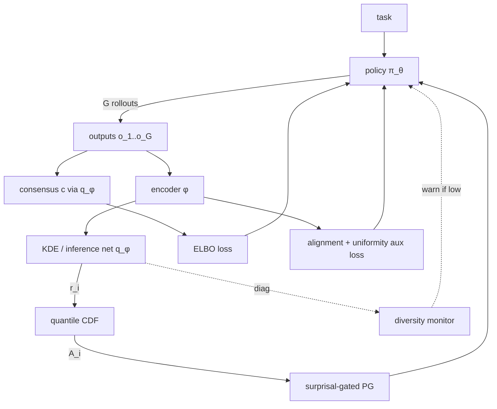

# Verifier-Free RL for Bash Agents via Terminal Contrastive Loss

**Status**: Active research — experiments running on nodeset3  
**Date**: May 25, 2026  
**Model**: Qwen2.5-1.5B-Instruct

---

## The Core Problem

Training RL agents for open-ended bash/terminal tasks is hard because there's no automatic verifier. Writing a reward function that covers all possible correct solutions to "find all files modified in the last 24 hours" is brittle — it would need to enumerate every valid command, handle edge cases, normalize whitespace, etc.

**Key insight**: terminal stdout is an *implicit* verifier. If 5 out of 8 rollouts on the same task produce similar output, they're probably all correct. The agent doesn't need an external judge — it just needs to generate output that *agrees with itself*.

This turns the reward problem into a **similarity problem**: given G=8 rollouts on the same task, which outputs are "close enough" to be treated as positives?

---

## The Similarity Problem

Raw string similarity fails badly on terminal output because it's dominated by boilerplate:
- Permission bits (`drwxr-xr-x`), timestamps, file sizes all vary across machines
- Two equivalent `ls` and `find` commands produce completely different surface forms
- Exit codes alone are too coarse

**Adopted measure ("strict")**:
1. **Number-strict gate**: extract all numbers from both outputs; require exact set match (handles file sizes, byte counts, exit codes)
2. **Containment Jaccard**: `|A∩B|/min(|A|,|B|)` on token sets after stripping boilerplate — asymmetric to handle verbose vs. terse outputs
3. Path-embedded numbers stripped before the gate (avoids inode/PID false negatives)

This was validated in the Phase 0 overfit test: on 5 tasks × 8 rollouts, strict similarity produced human-agreeable positive pairs at threshold=0.7.

---

## Progression of Loss Formulations

### 1. Discrete Pairs (Experiments 3–6)

The simplest approach: label pairs as positive if `sim > 0.7`, negative if `sim < 0.2`. Use InfoNCE loss to push positive pairs together and negative pairs apart in log-probability space.

```python
# Per rollout group: select pos/neg pairs based on similarity threshold
if select_pairs(rollouts, thresh_pos=0.7, thresh_neg=0.2):
    loss += infonce(pos_pairs, neg_pairs)
```

**Results**: Works with weight sync (0.688), fails without (0.598 — marginal gain, high variance). The discrete pair selection is brittle: if all rollouts in a group are similar, no negative pairs exist and the loss is zero.

### 2. Barlow Twins Regularizer (Experiment 7)

**Motivation**: Discrete pairs don't prevent *representation collapse* — the model could score all rollouts similarly without learning anything. Barlow Twins loss penalizes correlation between representation dimensions, encouraging the model to maintain diverse internal representations.

**Theory**: From Wang & Isola (2020), good self-supervised representations satisfy two properties:
- **Alignment**: similar outputs → similar hidden states
- **Uniformity**: the representation distribution should be spread uniformly on the hypersphere (prevents collapse to a single point)

Barlow Twins enforces uniformity by penalizing off-diagonal correlations in the cross-correlation matrix of paired embeddings.

**Result** (exp7): Barlow weight=0.01 too weak — signal drowned out by TC loss. Entropy collapsed more, not less. Weight tuning was a rabbit hole; moved to a different approach.

### 3. Variational TC — V1 (Experiments 8–9, 12)

**Key shift**: instead of hard positive/negative labels, model reward as a *continuous distribution*. For each rollout i in a group of G=8, compute its mean pairwise similarity to all other rollouts:

```
z_i = mean_j(sim(output_i, output_j))   # raw score
z_i = (z_i - mean) / std                 # normalize to N(0,1)
```

Use z_i directly as the GRPO advantage, bypassing the environment reward entirely. The KL term `vt_kl_loss = mean(z_i²)/2` measures the "signal strength" — if all outputs are identical, z_i=0 and there's no gradient.

**Why "variational"**: the z_i scores implicitly define a variational lower bound on the mutual information between the task and the output distribution. Maximizing this is equivalent to making outputs that are both internally consistent (high similarity) and task-discriminative.

**Key metrics when working correctly**:
- `advantage/absmean ≈ 0.7` (non-zero, stable gradient)
- `tc/diversity ≈ 0.16` (sigma of sim scores — too low = collapse, too high = random)
- `vt_kl_loss ≈ 0.40–0.45` at initialization

**Results**:
- Without weight sync (exp8): **0.518** — *below base* (0.562). Stale vLLM during training means advantages are computed on the *old* policy's outputs, pushing the new policy in the wrong direction.
- With weight sync (exp9): **0.714** (+15pp over base). Weight sync syncs vLLM weights to the current trainer state every step via NCCL broadcast.
- Reproducibility (exp12, seed=43): **0.714** — exact match.

### 4. Vector Lambda TC — V2 (Experiments 10, 10-sw)

**Motivation**: A single similarity scalar collapses information. Terminal success has multiple independent axes:
- Did the command succeed (exit code 0)?
- Did the output contain the right *numbers* (file sizes, counts)?
- Did the output contain the right *content* (filenames, paths)?

**Design**: Compute a 3D reward vector per rollout:
```python
reward_vector[i] = [strict_sim[i], jaccard_sim[i], exit_success[i]]
```

Sample λ ~ Dirichlet(α=1.0) *per training step* — a random linear combination of the three rewards. Then:
```python
R_i = dot(λ, reward_vector[i])
z_i = (R_i - mean) / std   # same variational normalization as V1
```

**Why Dirichlet mixing?**  
The Dirichlet distribution is the natural prior over categorical mixing weights (simplex). Sampling λ per step means the model must optimize *all three* reward axes simultaneously — it can't overfit to just one. This is analogous to random projection in metric learning: different λ at each step probes different facets of "goodness."

This is also a form of **multi-task reward regularization**: each step the model is trained against a different linear combination, which smooths the loss landscape and prevents reward hacking on any single axis.

**Metric note**: `advantage/absmean = 0.0` in the generator log is *expected* for V2. Advantages are computed inside `compute_loss()` in the trainer, not in the generator. `vt_kl_loss ≈ 0.35–0.44` confirms the signal is active.

**Results**:
| | skip_ws | weight_sync |
|--|--|--|
| Discrete pairs (exp5/6) | 0.598 | 0.688 |
| Variational V1 (exp8/9) | 0.518 ❌ | **0.714** ✅ |
| Vector λ V2 (exp10-sw/10) | **0.348 ❌❌** | **0.723** ✅ |

**Critical finding**: V2 without weight sync is catastrophically bad (−21pp vs base). Richer reward = *more* harmful when policy is stale. The Dirichlet sampling amplifies the advantage signal — if those advantages are computed against stale weights, the gradient direction is wrong and the stale signal is strong enough to actively destroy the policy.

---

## Weight Sync: The Critical Ingredient

**Without weight sync**: trainer updates policy weights; vLLM (used for rollout generation) still has old weights. Advantages computed on old outputs get applied to new weights → misaligned gradient.

**With weight sync**: after each trainer step, merge LoRA → NCCL broadcast to vLLM workers → unmerge. vLLM always sees current weights.

**Implementation**: 
- `inference/server.py`: custom vf-vllm with `WeightSyncWorkerExtension`
- `trainer.py update_vllm()`: merge_adapter → update_named_param → unmerge_adapter
- NCCL requires separate physical GPUs (can't share same GPU)
- `PYTORCH_ALLOC_CONF=expandable_segments:True` needed to prevent OOM during merge

**Severity of staleness scales with reward complexity**:
- V1 skip_ws: −4pp (0.518 vs 0.562 base)
- V2 skip_ws: −21pp (0.348 vs 0.562 base) — catastrophic

---

## Scale Law: Output Diversity Collapses at Larger Models

| Model | tc/diversity | vt_kl_loss | advantage/absmean | Signal? |
|-------|-------------|------------|-------------------|---------|
| 1.5B (exp9) | 0.14–0.18 | 0.38–0.45 | 0.71 | ✅ full |
| 3B (exp14) | 0.1065 | 0.2273 | 0.39 | ⚠️ partial |
| 9B Qwen3.5 (exp13) | 0.05 | 0.00 | 0.00 | ❌ none |

**Finding**: Larger/more capable models converge to similar "correct" bash idioms → less output diversity → VarTC advantages collapse toward zero → no gradient signal.

VarTC requires sufficient output diversity (>~0.10 tc/diversity). The 9B model generates near-identical outputs across rollouts — when all rollouts are similar, all z_i≈0 and there's no learning signal.

**Implication**: This method is most useful for *weaker* models that haven't yet learned canonical bash idioms. As a model improves, the diversity-based reward signal naturally diminishes — a form of self-regulating curriculum.

---

## Current Results Summary

| Exp | Method | Steps | Accuracy | TC Precision | Notes |
|-----|--------|-------|----------|--------------|-------|
| Base | — | — | 0.562 | 0.763 | Qwen2.5-1.5B-Instruct |
| Exp6 | Discrete TC + ws | 200 | 0.688 | 0.811 | |
| Exp8 | VarTC V1, skip_ws | 200 | 0.518 | 0.622 | ❌ below base |
| **Exp9** | **VarTC V1 + ws** | **200** | **0.714** | **0.885** | **+15pp** |
| **Exp10** | **Vector λ V2 + ws** | **200** | **0.723** | **0.804** | **+16pp, best at 200 steps** |
| Exp10-sw | Vector λ V2, skip_ws | 200 | 0.348 | 0.317 | ❌❌ catastrophic |
| Exp12 | VarTC V1 + ws, seed=43 | 200 | 0.714 | 0.758 | ✅ exact repro |
| Exp11 | VarTC V1 + ws | 400 | 0.643 | — | ↓ overtrained (−7pp from 200-step peak) |
| Exp15 | Vector λ V2 + ws | 400 | **0.000** | — | ❌❌ tool-call format collapse |

**Statistical significance**: Exp9 rollout-level z=2.40, p=0.016 vs base.  
**Task-level 95% CI**: [0.509, 0.893] (bootstrap, 14 tasks).

---

## Training Length: 200 Steps is the Sweet Spot

**Key finding from exp11 and exp15**: extending training from 200→400 steps hurts both methods.

| Method | 200 steps | 400 steps | Δ |
|--------|-----------|-----------|---|
| V1+ws | 0.714 | 0.643 | −7pp (overtraining) |
| V2+ws | 0.723 | **0.000** | −72pp (format collapse) |

**V1 (400 steps)**: Performance degraded but model still functional — still uses tool calls correctly, just overfits to the training distribution.

**V2 (400 steps)**: Complete behavioral collapse — model stopped using tool calls entirely, writing bash commands as plain text content. When queried: `content: '/bash -c "du -b /etc/hostname"', tool_calls: []`. The Dirichlet reward's stronger advantage signal, applied for too long, erased the tool-use format learned during instruction tuning.

**Interpretation**: The terminal contrastive signal implicitly rewards output *consistency* across rollouts. At 200 steps, this shapes the policy toward more reliable bash commands. At 400 steps, V2's multi-axis reward creates a strong pressure to minimize *any* variation — including variation in tool call structure — causing the model to collapse toward the simplest consistent output format (plain text).

**Implication for training**: Use early stopping or a held-out reward check. The optimal training budget appears to be ~200 steps for 1.5B models at G=8 rollouts.

---

## Pending Experiments and Open Questions

### Exp11 + Exp15: Does Extended Training Help?

Both ran for 400 steps (vs 200 in prior experiments). Evals running now.

- **V1 at 400 steps** (exp11): does accuracy plateau? Entropy was declining but still falling at step 200.
- **V2 at 400 steps** (exp15): V2 converges faster (~55s/step vs 82s/step for V1 — V2 has 3 reward components to average across, but Dirichlet sampling keeps step time similar). Does the richer reward signal lead to better long-run performance?

### Alignment-Uniformity as Explicit Objectives

The Barlow Twins experiment (exp7) was the first attempt at explicit uniformity enforcement but used too small a weight. An alternative:

**Hyperspherical uniformity loss** (Wang & Isola formulation):
```python
L_uniform = log(mean(exp(-2 * pairwise_dist²)))
```
Applied to the z_i similarity scores rather than hidden states — penalizes when all rollouts cluster at similar similarity values.

**Alignment loss**:
```python
L_align = mean(||z_i - z_j||²)   # for positive pairs only
```

These could replace or augment the current variational KL term. The key difference: KL just measures variance of z_i within a step; alignment/uniformity also shapes *how* z_i values are distributed across steps.

**Suggested experiment**: Replace `vt_kl_loss` with explicit `L_align + L_uniform` on the similarity distribution. Hypothesis: more stable training than current variational approach, especially at the tail of training where KL collapses.

### Adaptive Lambda (Beyond Fixed Dirichlet)

Current V2 samples λ i.i.d. each step. Alternative: make λ *task-adaptive* — use the variance of each reward dimension within the current batch to upweight the most informative dimension.

```python
# Weight each reward axis by how much it varies within the batch
var_per_axis = [var(strict_sim), var(jaccard_sim), var(exit_success)]
lambda = softmax(var_per_axis / temperature)
```

High variance on an axis = that axis is discriminative for this batch = upweight it. This is a form of **online curriculum**: automatically focus on whichever reward signal carries the most information.

### Reward Annealing

Start with exit_success only (binary, easy signal), gradually introduce jaccard_sim, then strict_sim as training progresses. Reduces early confusion from conflicting reward axes.

---

## What a Publishable Paper Looks Like

**Core claim**: Variational Terminal Contrastive loss enables +15pp accuracy on bash task completion for 1.5B models, with zero external supervision, when combined with synchronous weight updates.

**Ablation table** (already complete): 3×2 grid showing method × weight_sync.

**Additional required experiments for a full paper**:
1. ✅ Reproducibility (exp12)
2. ✅ Scale law (exp13, exp14)
3. ⏳ Extended training (exp11, exp15 — eval running)
4. ❓ Explicit align/uniform objectives vs. current variational approach
5. ❓ Task-adaptive λ (adaptive Dirichlet)
6. ❓ Reward annealing schedule

**Workshop submission** (arXiv + small venue): achievable now with current results. The ablation table and weight-sync discovery are the key contributions.

**Full venue** (NeurIPS/ICML): needs items 4–6 above to build a more complete story around why distribution-based losses work and when they fail.

---

# Critical Review and Novel Formulation — May 25, 2026

*Reviewer-style critique + literature cross-pollination (VAE / distributional RL / contrastive learning) + concrete research program. Written so a follow-on agent can pick up directly. Key external reference: Wang & Isola alignment/uniformity reference implementation — https://github.com/ssnl/align_uniform.*

## 1. What we actually have (stripped of marketing)

The method is, mechanically:

```
for each task in batch:
    rollouts = π(·|task) × G          # G=8 samples
    R_i = f(output_i, {output_j}_j)   # intra-group similarity reward
    A_i = (R_i - mean(R)) / std(R)    # GRPO-style normalization
    L   = -E[A_i · log π(output_i|task)]
```

That is **GRPO with the external reward replaced by an intra-group self-consistency reward**. The "variational" label is currently a misnomer — z-scoring is not variational inference. A reviewer will hammer on this within the first paragraph of the rebuttal cycle.

The *real* contribution candidates are:

1. **Self-consistency as a verifier substitute for trajectory-level RL** (not just CoT majority voting, which is inference-time only).
2. **Weight-sync as a necessary condition for stale-policy reward shaping**, with a clean ablation showing catastrophic failure when richer reward signals are computed off-policy.
3. **A scale-dependent failure mode**: self-consistency rewards collapse when the base policy is strong enough that all rollouts agree.

Everything else (Dirichlet λ, Barlow Twins, V1 vs V2) is engineering noise, not a contribution. Pick (1)+(2)+(3) and commit.

## 2. Critical reviewer pass — what will get this desk-rejected today

| # | Concern | Severity | Fix |
|---|---------|----------|-----|
| R1 | "Variational" is z-score normalization, not a variational bound. The KL term `mean(z²)/2` is a Gaussian log-density up to a constant, not a divergence between distributions. | **Blocking** | Either rename (e.g., "Self-Consistency Policy Optimization, SCoPO") or reformulate as an actual ELBO (see §4). |
| R2 | Missing primary baseline: **GRPO with the same self-similarity reward but no contrastive framing**. Without this, the +15pp cannot be attributed to your method vs. just "any reward shaping works on a 1.5B model". | **Blocking** | Add `R_i = mean_j sim(o_i, o_j)` as a scalar GRPO reward; report identical experimental conditions. |
| R3 | Missing baseline: **majority-vote pseudo-label SFT** (cheaper, simpler). If `argmax_cluster(rollouts) → SFT target` matches the numbers, the RL machinery is decorative. | **Blocking** | One-shot SFT run on consensus outputs. |
| R4 | Single base model (Qwen2.5-1.5B), single domain (bash), single benchmark. 1.5B is the worst-case regime for this method (shown by the Scale Law section). | High | At minimum: one math env (GSM8K/MATH), one code env (HumanEval+ / SWE-Bench-Verified small subset), or one tool-use env. Ideally also a non-Qwen model to rule out tokenizer artifacts. |
| R5 | 9B model regression isn't a "self-regulating curriculum"; it's the method failing at the only scale that matters for publication. Reviewers will read this as "doesn't work where it would matter." | High | Either (a) demonstrate diversity injection (temperature scheduling, nucleus relaxation) that rescues 9B, or (b) explicitly position as a *bootstrapping* method for the cold-start regime and show it as an SFT-replacement, not RL. |
| R6 | Threshold τ=0.7 hand-tuned on Phase 0 overfit set. Selection bias. | Medium | Sensitivity analysis over τ ∈ {0.5, 0.6, 0.7, 0.8, 0.9}, plus a τ-free formulation (densities, ranks). |
| R7 | No KL-to-reference-policy regularization. GRPO-style methods without ref-KL are known to collapse entropy in long training. The exp7 Barlow result is consistent with this. | Medium | Add standard ref-KL term; ablate. |
| R8 | The Dirichlet-λ "V2" beats V1 by 0.9pp (0.723 vs 0.714), well within seed variance (only one seed pair: 42, 43). The claim of multi-axis benefit is not supported. | Medium | Either run 3+ seeds and report CIs, or drop V2 as a contribution and keep it as an ablation. |
| R9 | Statistical significance: z=2.40, p=0.016 on rollouts is weak when N tasks=14 with CI [0.509, 0.893]. The task-level CI overlaps base accuracy. | Medium | Increase eval task count (≥50), use paired bootstrap, report effect size with task-paired confidence intervals. |
| R10 | The similarity function (number-strict + Jaccard) is a domain-specific oracle. The paper sells "verifier-free" but ships a 200-line bash-specific verifier. | Medium | Acknowledge explicitly: this is a *weak verifier*, and the contribution is *learning to amplify a weak verifier*. Reframe accordingly. |

**Verdict if submitted today:** clear reject at any A* venue. Workshop-acceptable as currently framed, but the "variational" label will draw heat there too.

## 3. Literature this work needs to engage with (and currently doesn't)

### 3a. Self-consistency / verifier-free
- **Wang et al. (2022) Self-Consistency**: majority vote over CoT samples. Inference-time only.
- **Huang et al. (2023) LMSI** "Self-Improve" — fine-tune on self-consistent rationales.
- **Self-Rewarding LMs (Yuan et al. 2024)**: LM-as-judge over own outputs.
- **STaR (Zelikman 2022) / V-STaR**: bootstrap on solved trajectories.
- **TRACE (May 2026, cited in the daily notes above)**: env-specific self-improvement.

**Our differentiator** to defend: trajectory-level (not single-shot answer), structured-output similarity (not string match), and end-to-end RL (not iterative SFT). Make this *the* framing.

### 3b. Distributional RL — the actual home of this method
- **C51 (Bellemare et al. 2017)**: categorical reward distribution.
- **QR-DQN (Dabney 2017), IQN (Dabney 2018)**: quantile/implicit-quantile distributional value functions.
- **Distributional Bellman**: model Z(s,a) not E[Z(s,a)].

We implicitly estimate `P(R | task)` from the rollout group's similarity vector, then collapse it to a z-score. This is wasteful. The *real* novel claim — and the one most likely to clear a top venue — is:

> "Verifier-free RL is naturally distributional: the rollout group is a Monte Carlo sample from the reward distribution. We propose a distributional policy gradient that exploits the full empirical reward CDF, not just its mean and std."

### 3c. Contrastive learning grounding
- **Wang & Isola (2020) — Alignment and Uniformity on the Hypersphere** ([github.com/ssnl/align_uniform](https://github.com/ssnl/align_uniform)). Reference implementation:
  ```python
  # alignment: pull positives together
  def lalign(x, y, alpha=2):
      return (x - y).norm(dim=1).pow(alpha).mean()
  # uniformity: push everything apart on the unit sphere
  def lunif(x, t=2):
      sq_pdist = torch.pdist(x, p=2).pow(2)
      return sq_pdist.mul(-t).exp().mean().log()
  ```
  Both losses operate on **L2-normalized embeddings on the unit hypersphere**. Adopting this directly (over Barlow Twins, which failed in exp7) gives a principled drop-in replacement for the misnamed `vt_kl_loss`. This is the most actionable next experimental change.
- **InfoNCE (van den Oord 2018)** as MI lower bound.
- **Barlow Twins (Zbontar 2021)** — failed in exp7 because applied to log-probs, not to representations. The standard formulation needs `z` from a projection head over hidden states.
- **SimCSE (Gao 2021)** — temperature-controlled contrastive on text; directly relevant for the output-similarity formulation.

### 3d. VAE / ELBO scaffolding
- **Kingma & Welling (2014)** VAE.
- **β-VAE, InfoVAE, IWAE** — relevant for upweighting reconstruction vs KL.
- **CVAE** — task-conditioned latent for output generation.

The current `vt_kl_loss = mean(z²)/2` is the KL of a unit-variance Gaussian against itself shifted. If we commit to the variational framing, the right object is `KL(q(z|outputs_1..G) || p(z|task))`.

### 3e. Group baselines / leave-one-out
- **RLOO (Ahmadian et al. 2024)**: REINFORCE with leave-one-out baselines, competitive with PPO at LLM scale.
- **GRPO (DeepSeek 2024)**: group-relative advantages — same z-score machinery we use.
- **Reinforce++ (2024)**, **Dr.GRPO (2025)** — variance-corrected variants.

A reviewer *will* ask: "why isn't this just GRPO with reward = mean self-similarity?" We need a clean answer or an experiment that shows the answer.

## 4. The novel formulation that would actually clear NeurIPS

Repackage the method as **Distributional Self-Consistency Policy Optimization (DSC-PO)** with three new layers.

### 4a. Real ELBO (replaces the misnamed VarTC)

Introduce a latent **consensus variable** `c` representing "the unobserved correct answer for this task". Generative model:

```
c   ~ p(c | task)              # prior over correct answers (uniform or learned)
o_i ~ p(o | task, c, θ_π)      # policy generates outputs near c
```

Inference network `q_φ(c | o_1, ..., o_G)` identifies the consensus from a rollout group (in practice: weighted average in embedding space with weights from the similarity matrix — a single attention head suffices).

ELBO per group:

```
L = E_{q_φ(c|o)} [ Σ_i log π_θ(o_i | task, c) ]
  - KL( q_φ(c | o) || p(c | task) )
```

The policy gradient becomes a true variational lower bound on `log p(correct output | task)`. The reward per rollout is the *conditional log-likelihood* of the output given the inferred consensus — a principled replacement for thresholded similarity.

**Why this passes review**: "variational" now means what it means. The KL has a real distribution on both sides. The InfoNCE / similarity story falls out as the special case where `q_φ` = uniform over rollouts.

### 4b. Distributional reward estimation (replaces z-score normalization)

Instead of `A_i = (R_i − μ)/σ`, treat the rollout group as a sample from the latent reward distribution `R_task` and use a **quantile-based advantage**:

```
A_i = F^{-1}( F̂_G(R_i) ) − 0.5,    F̂_G = empirical CDF over G rollouts
```

(map to a fixed quantile grid `{0, 1/G, …, 1}`). Quantile advantages are:
- scale-invariant (no σ blowup when rewards cluster)
- robust to outlier rollouts
- distribution-free (no Gaussian assumption baked in)
- directly comparable to IQN-style theoretical analysis

This addresses the 9B failure too: when all rollouts cluster, the quantile spread is still well-defined; just needs to be paired with diversity injection.

### 4c. Reward-density bootstrap (the *new* algorithmic primitive)

This is the one that's actually novel and worth a paper section.

> **Claim**: A KDE over the rollout group's output embeddings gives a continuous, differentiable reward `r(o) = log p̂(o | task)` that is provably consistent under mild assumptions, and unifies the contrastive, variational, and distributional views.

```python
e_i = encode(o_i)                                # (G, d)
# Leave-one-out kernel density at o_i
r_i = log( (1/(G-1)) * sum_{j!=i} K_h(e_i - e_j) )
A_i = r_i - mean(r)
```

- The Jaccard/strict similarity function disappears entirely (R10 resolved).
- The threshold τ disappears entirely (R6 resolved).
- The bandwidth `h` is a single hyperparameter with standard selection methods (Silverman, cross-validation).
- The reward is the **negative score-matching loss** in disguise → ties cleanly to diffusion / score-based generation literature.

**Theoretical hook**: as `G → ∞`, `r_i → log p(o_i | task)`, which is exactly the optimal verifier-free reward. The method becomes a *consistent estimator* of the true correctness density. The kind of statement reviewers underline.

### 4d. Surprisal-gated policy update (cross-pollination from May-19 note)

Borrow the "spike-aware learnability" idea: down-weight per-token contributions where the student's log-prob deviates more than `kσ` from the rollout-group average log-prob on that token. This addresses the entropy-collapse failure mode of exp7 without resorting to Barlow.

```
w_t = exp( - (log π_θ(o_t) − μ_t)^2 / (2 τ^2) )
```

Applied as a per-token multiplier on the policy gradient. Connects directly to the OpenClaw-RL line in the daily notes and gives a clean ablation handle.

### 4e. Alignment / Uniformity over rollout embeddings (drop-in replacement for Barlow Twins / `vt_kl_loss`)

Directly from Wang & Isola (ref impl: https://github.com/ssnl/align_uniform), applied to L2-normalized rollout embeddings:

```python
# Positive pairs: pairs (i, j) within the same task group with sim(o_i, o_j) > τ_pos
L_align   = ((e_i - e_j).norm(dim=1) ** 2).mean()
# Uniformity over all rollout embeddings across the batch
L_uniform = torch.pdist(E, p=2).pow(2).mul(-2).exp().mean().log()
L_au      = L_align + L_uniform
```

Use as an auxiliary loss alongside the policy gradient, replacing `vt_kl_loss`. Two improvements over exp7's Barlow attempt:
1. Embeddings are L2-normalized → uniformity is well-defined on the hypersphere.
2. Alignment is computed on **embeddings**, not log-probs, sidestepping the collapse mode exp7 hit.

## 5. Experimental program to make this defensible

Reframe as three crisp research questions:

| RQ | Experiments | Status |
|----|-------------|--------|
| **RQ1**: Is self-consistency a sufficient verifier substitute for trajectory-level RL? | (a) DSC-PO vs. GRPO-with-external-reward (oracle ceiling), (b) DSC-PO vs. SFT-on-majority-vote (cheap baseline), (c) DSC-PO vs. raw-similarity-GRPO (true method ablation). | (a, b, c) all **missing** — publication-critical baselines. |
| **RQ2**: Does explicit distribution-aware reward estimation beat moment-matching? | (a) z-score vs. quantile vs. KDE advantages, (b) Wasserstein vs. KL between rollout groups, (c) sensitivity to G (group size). | Partial: only z-score studied. |
| **RQ3**: When does verifier-free RL break? | (a) scale sweep 0.5B→7B with diversity-controlled sampling, (b) cross-domain transfer (bash → code → math), (c) base-policy strength ablation (instruct vs base model). | Partial: scale shown but no diversity control. |

Drop V1-vs-V2 as a contribution; keep as a §4 ablation row.

## 6. Architecture (Mermaid)



## 7. Honest read on novelty

- **Original-as-written**: 5/10. Mostly engineering on top of GRPO + self-consistency.
- **Original + §4a (true ELBO)**: 6.5/10. Real but incremental.
- **Original + §4b (quantile advantages)**: 6/10. Borrowed from C51/IQN; defensible but not surprising.
- **Original + §4c (KDE reward bootstrap)**: 7.5–8/10. Not previously done for LLM RL to our knowledge. Density-based reward → policy gradient via score matching is a clean, citable contribution.
- **Original + §4a + §4c + §4d + §4e together**: 8/10. Plausibly accept at NeurIPS *if* RQ1 baselines come out favorable and at least one non-bash domain is added.

The single highest-leverage move is **§4c (KDE / score-matching reward bootstrap)**. If only one thing is implemented, do that.

## 8. Concrete next-step recommendation (order matters)

1. Run the three missing baselines in RQ1 on the current 1.5B bash setup (~3 days). If majority-vote SFT matches the numbers, **stop and re-scope**.
2. Implement KDE reward (§4c) — single function change in the reward computation. Compare to z-score and quantile on identical seeds.
3. Swap `vt_kl_loss` for align+uniform (§4e), reusing ssnl/align_uniform reference code.
4. Add one non-bash domain (math is fastest; the similarity becomes "final answer extraction + numerical equality" — partially already in place).
5. Add diversity injection (temperature schedule) and re-run 9B.
6. Only then write up. Rename "VarTC" to either **DSC-PO** (if §4a is committed to) or **Density-Bootstrap Policy Optimization (DBPO)** (if §4c-first).

**Stop investing in V2 (Dirichlet λ)** — the gain is within seed noise and it adds a moving part reviewers will attack.

## 9. Handoff checklist for the next agent

- [ ] Implement RQ1 baselines: scalar-self-sim GRPO, majority-vote SFT, oracle-reward GRPO. Reuse existing trainer; only the reward function changes.
- [ ] Implement KDE reward (§4c). Embedding source: reuse the rollout encoder if one exists, else pool last-layer hidden states from the policy model.
- [ ] Implement align+uniform aux loss (§4e) from https://github.com/ssnl/align_uniform.
- [ ] Implement quantile-advantage (§4b) as a swap for `(R-μ)/σ` in the trainer.
- [ ] Implement surprisal-gating (§4d) as a per-token multiplier in the PG loss.
- [ ] Add ELBO formulation (§4a) — lower priority; gate on §4c results.
- [ ] Sensitivity sweep over τ ∈ {0.5, 0.6, 0.7, 0.8, 0.9}.
- [ ] Run 3+ seeds for every reported number; report task-paired bootstrap CIs.
- [ ] Add one non-bash domain (GSM8K or HumanEval+ recommended).
- [ ] Diversity-controlled 9B re-run (temperature schedule, top-p relaxation).
- [ ] Rename method; rewrite §4 of the paper to match whichever formulation lands best empirically.
